# Session 11 - Kubernetes Networking & Services Homework

All work is done in namespace `s11` on a 2 node minikube cluster.

```bash
kubectl create ns s11
kubectl config set-context --current --namespace=s11
```

# Task 1: Kubernetes Services

## 1. ClusterIP

YAML: [01-clusterip/](01-clusterip/)

ClusterIP gives a stable internal IP, only reachable from inside the cluster. Service port is `8080` and it forwards to container port `80`.

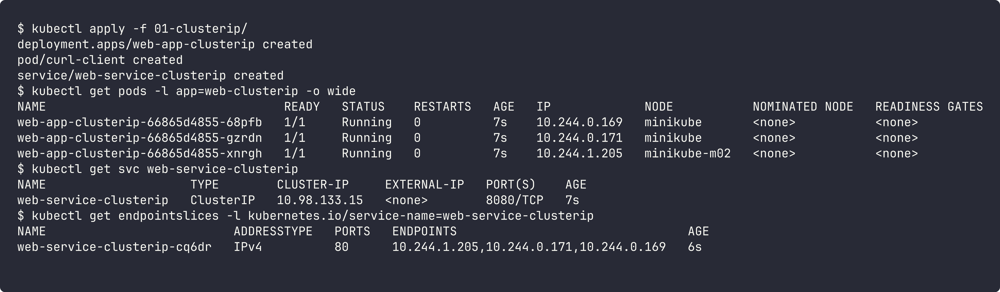

Tested from the `curl-client` pod using the service name:

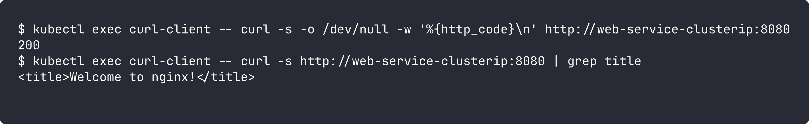

## 2. NodePort

YAML: [02-nodeport/](02-nodeport/)

NodePort opens port `30080` on every node and forwards it to the pods.

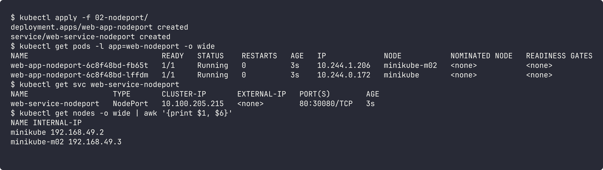

Tested using both node IPs and also from inside the minikube node. It works on both nodes even though pods can be on any node.

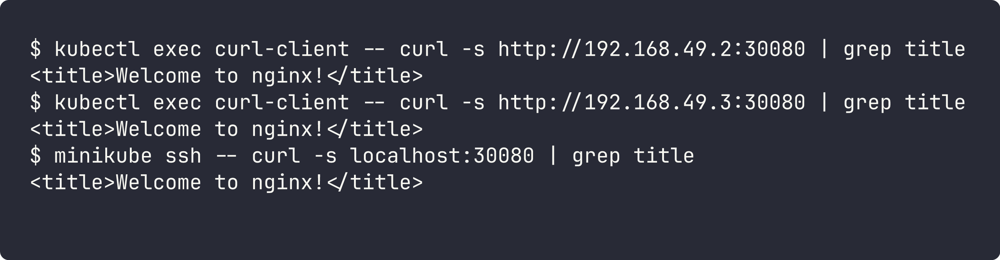

## 3. LoadBalancer

YAML: [03-loadbalancer/](03-loadbalancer/)

On minikube there is no cloud load balancer, so EXTERNAL-IP stays `<pending>`. I enabled the MetalLB addon and gave it an IP range from the minikube network so the service gets a real external IP.

```bash
minikube addons enable metallb
kubectl patch cm config -n metallb-system --type merge -p '{"data":{"config":"address-pools:\n- name: default\n  protocol: layer2\n  addresses:\n  - 192.168.49.200-192.168.49.210\n"}}'
kubectl rollout restart deploy/controller -n metallb-system
```

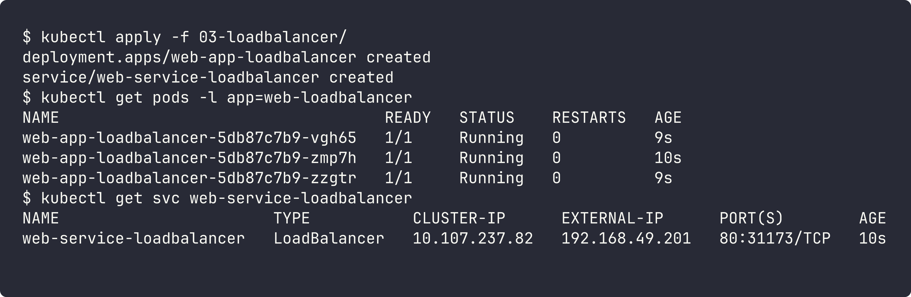

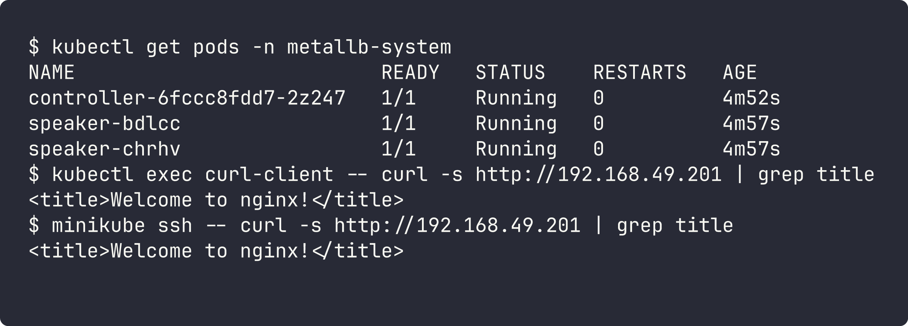

## 4. ExternalName

YAML: [04-externalname/](04-externalname/)

ExternalName has no pods and no ClusterIP. CoreDNS just returns a CNAME to the external domain.

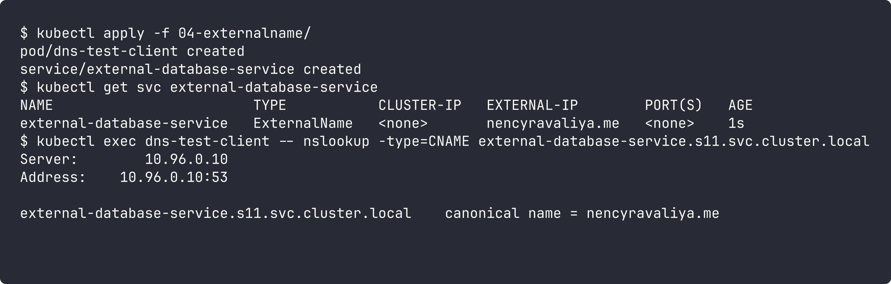

To see the full CNAME → IP resolution, I pointed it to `example.com`:

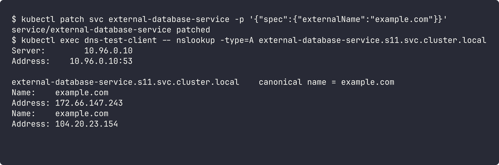

## 5. Headless

YAML: [05-headless/](05-headless/)

Headless service has `clusterIP: None`. DNS returns the pod IPs directly instead of one virtual IP, and with a StatefulSet every pod gets its own DNS name.

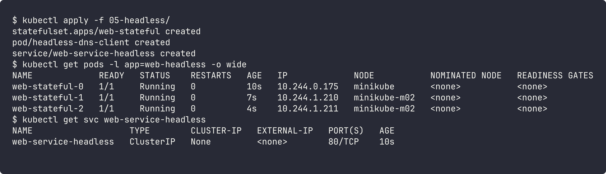

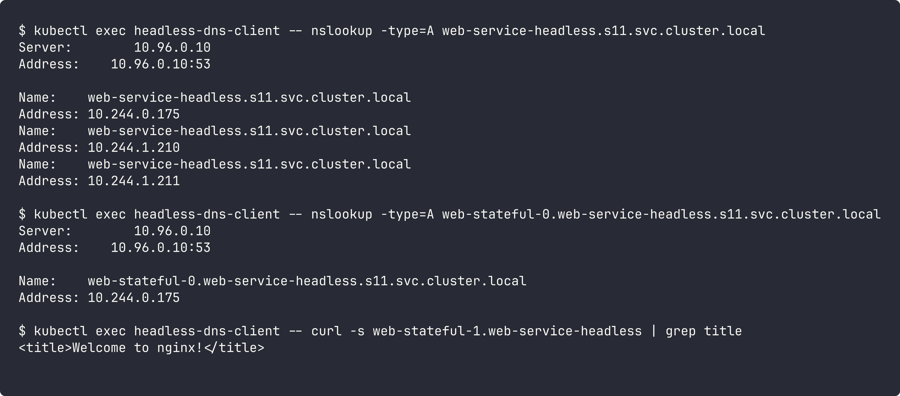

## All services

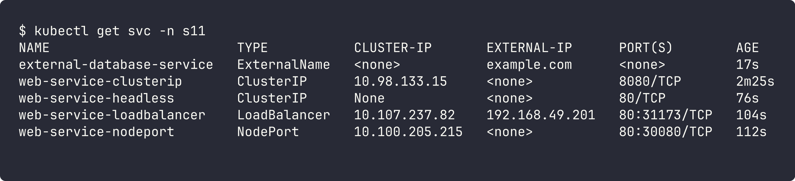

# Task 2: Kubernetes Object Comparison

## Deployment vs ReplicaSet

| | ReplicaSet | Deployment |
|---|---|---|
| Purpose | keep N copies of a pod running | manage app releases on top of ReplicaSets |
| Pod management | creates/deletes pods directly to match replicas | does not touch pods directly, it manages ReplicaSets |
| Scaling | `kubectl scale rs` | `kubectl scale deploy`, it passes the count to its ReplicaSet |
| Rolling updates | no, changing the template does not update running pods | yes, creates a new ReplicaSet and shifts pods slowly, supports rollback |

**Relationship:** a Deployment owns one or more ReplicaSets. On every template change it makes a new ReplicaSet and scales the old one down to 0 (old one is kept for `rollout undo`). So in practice we create Deployments and never ReplicaSets directly.

## Deployment vs DaemonSet vs StatefulSet

| | Deployment | DaemonSet | StatefulSet |
|---|---|---|---|
| Use cases | stateless apps (web, API) | one agent per node (logs, monitoring, CNI) | stateful apps (databases, Kafka) |
| Pod creation | random names, created in parallel | one pod per node, created when a node joins | ordered names `app-0, app-1...` created one by one |
| Scaling | change `replicas` | follows number of nodes, no replicas field | change `replicas`, scales up/down in order |
| Networking | normal Service, pods are same | usually hostPort / hostNetwork or service | needs headless service, each pod gets stable DNS name |
| Storage | shared or none | usually hostPath | `volumeClaimTemplates`, each pod gets its own PVC that stays after restart |
| Examples | nginx, frontend | fluentd, node-exporter, kube-proxy | mysql, mongodb, zookeeper |

## ReplicaSet vs Service

- **ReplicaSet responsibility:** make sure the right number of pods are running. If a pod dies it creates a new one (with a new IP).
- **Service responsibility:** give one stable IP + DNS name for a group of pods and load balance traffic to them.
- **Why Service is required:** pod IPs change every time a pod is recreated or scaled. Clients can't keep track of that, so they talk to the service name and the service keeps an updated list of pod IPs.
- **How traffic reaches pods:** client calls `service-name` -> CoreDNS returns ClusterIP -> kube-proxy rules (iptables) on the node pick one ready pod from the EndpointSlice -> traffic goes to `targetPort` on that pod. Service finds pods using the label `selector`, it does not care which ReplicaSet created them.

# Task 3 & 4

- FQDN: [fqdn/README.md](fqdn/README.md)
- CoreDNS: [coredns/README.md](coredns/README.md)
