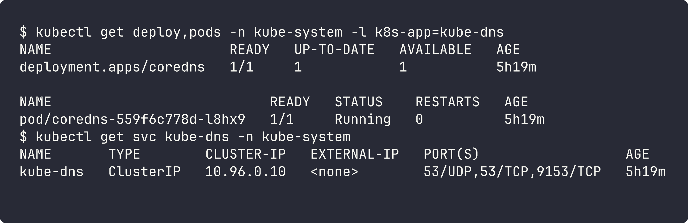
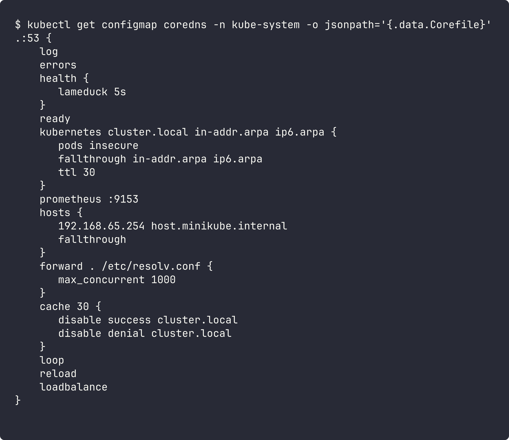
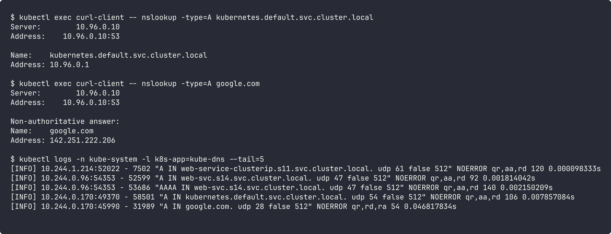

# CoreDNS

## What is CoreDNS?

CoreDNS is a DNS server written in Go, built with plugins. In Kubernetes it runs as a Deployment in `kube-system` and is exposed with the `kube-dns` service (`10.96.0.10`).

## Why Kubernetes uses CoreDNS

- It replaced kube-dns as default from v1.13
- Single binary, faster and less memory than kube-dns (which had 3 containers)
- Plugin based, so easy to add things like caching, rewrite, metrics
- Watches the API server so new services get DNS records right away

## How Service discovery works

1. A Service is created.
2. CoreDNS `kubernetes` plugin watches Services and EndpointSlices from the API server.
3. It creates records like `my-svc.ns.svc.cluster.local -> ClusterIP` (or pod IPs for headless).
4. kubelet puts `nameserver 10.96.0.10` and search domains into every pod's `/etc/resolv.conf`.
5. Apps just use the service name.

## How DNS queries are resolved

1. App asks for `web-service-clusterip`.
2. Because of `ndots:5` and search list, resolver tries `web-service-clusterip.s11.svc.cluster.local` first.
3. Query goes to CoreDNS.
4. If the name ends with `cluster.local`, the `kubernetes` plugin answers it.
5. Anything else (like `google.com`) is forwarded to upstream DNS using the `forward` plugin.

## CoreDNS configuration

Config is in the `coredns` ConfigMap (Corefile):

| Plugin | Use |
|---|---|
| `errors` / `log` | log errors and queries |
| `health` / `ready` | health and readiness endpoints |
| `kubernetes` | answers `cluster.local` names from the cluster |
| `prometheus :9153` | metrics |
| `hosts` | static entries (minikube adds `host.minikube.internal`) |
| `forward . /etc/resolv.conf` | send external queries upstream |
| `cache 30` | cache answers for 30s |
| `loop`, `reload`, `loadbalance` | detect loops, auto reload config, round robin answers |

## How to troubleshoot DNS issues

1. Check CoreDNS pods are running: `kubectl get pods -n kube-system -l k8s-app=kube-dns`
2. Check pod resolv.conf: `kubectl exec <pod> -- cat /etc/resolv.conf`
3. Test internal and external names with `nslookup` from a pod
4. Check service and endpoints exist: `kubectl get svc,endpointslices`
5. Check CoreDNS logs: `kubectl logs -n kube-system -l k8s-app=kube-dns`
6. Check the Corefile for mistakes
7. Remember short name only works in the same namespace

