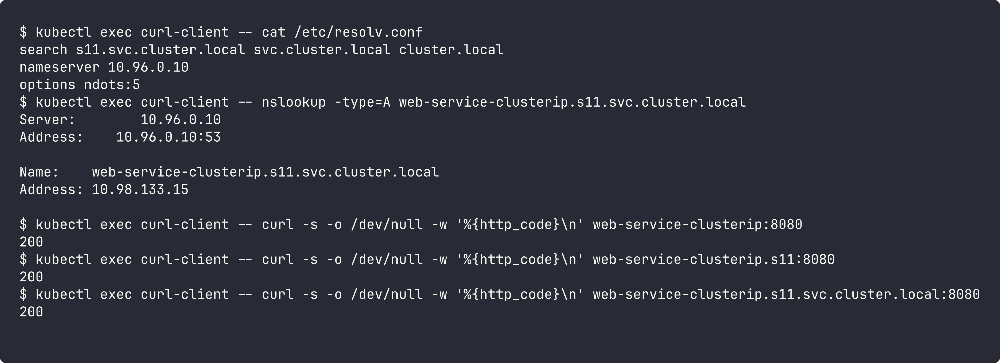
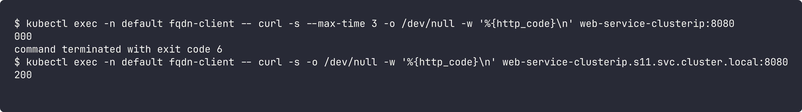

# FQDN in Kubernetes

## What is FQDN?

FQDN (Fully Qualified Domain Name) is the complete domain name of a host, with all the parts up to the root. Example: `www.google.com.` For a service in kubernetes it looks like `my-svc.my-namespace.svc.cluster.local`.

## Kubernetes Service DNS

Every Service gets a DNS record automatically from CoreDNS. Pods can reach a service by name instead of IP. Normal service resolves to its ClusterIP, headless service resolves to the pod IPs.

## DNS naming convention

```
<service-name>.<namespace>.svc.<cluster-domain>
```

- `svc` - fixed, means it is a service record
- `cluster.local` - default cluster domain

For StatefulSet pods behind a headless service:

```
<pod-name>.<headless-service>.<namespace>.svc.cluster.local
```

## Namespace-based DNS

Every pod has a `/etc/resolv.conf` with search domains for its own namespace. Because of that:

- same namespace: just `service-name` works
- other namespace: need at least `service-name.namespace`

## Pod-to-Service communication

Pod calls the name -> resolver adds search domains -> CoreDNS (10.96.0.10) returns ClusterIP -> kube-proxy sends it to one of the pods.

Testing from a pod in `s11` (same namespace), short name, `name.namespace` and full FQDN all work:



From a pod in `default` namespace, short name fails but FQDN works:



## Examples of Kubernetes FQDNs

| Name | What |
|---|---|
| `kubernetes.default.svc.cluster.local` | API server service |
| `kube-dns.kube-system.svc.cluster.local` | CoreDNS service |
| `web-service-clusterip.s11.svc.cluster.local` | my ClusterIP service |
| `web-service-headless.s11.svc.cluster.local` | headless service (returns all pod IPs) |
| `web-stateful-0.web-service-headless.s11.svc.cluster.local` | one StatefulSet pod |
