# Session 12 - Ingress, ConfigMaps & Secrets Homework

ConfigMap, Secret and troubleshooting are done in namespace `s12`. The Ingress demo files have `namespace: default` in them so that part runs in `default`.

# Task 1: ConfigMap

YAML: [01-configmap/app-config.yaml](01-configmap/app-config.yaml)

**Create ConfigMap and store config values**

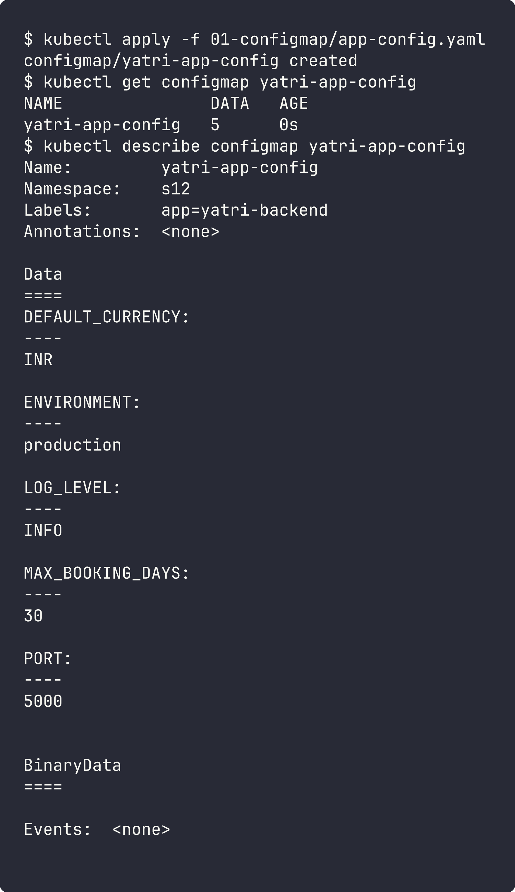

**Inject into Pod** - [app/backend-with-config.yaml](app/backend-with-config.yaml) uses `envFrom` with `configMapRef` (and `secretRef` for Task 2), so every key becomes an env variable.

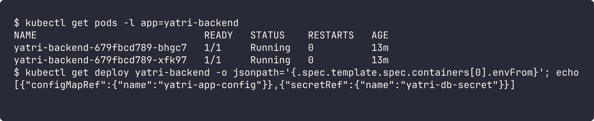

**Verify inside the container**

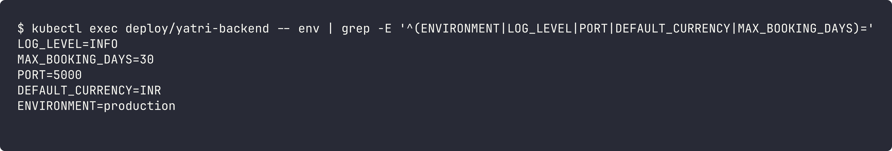

# Task 2: Secret

YAML: [02-secret/db-secret.yaml](02-secret/db-secret.yaml)

**Create Secret** - `describe` only shows the size, not the values.

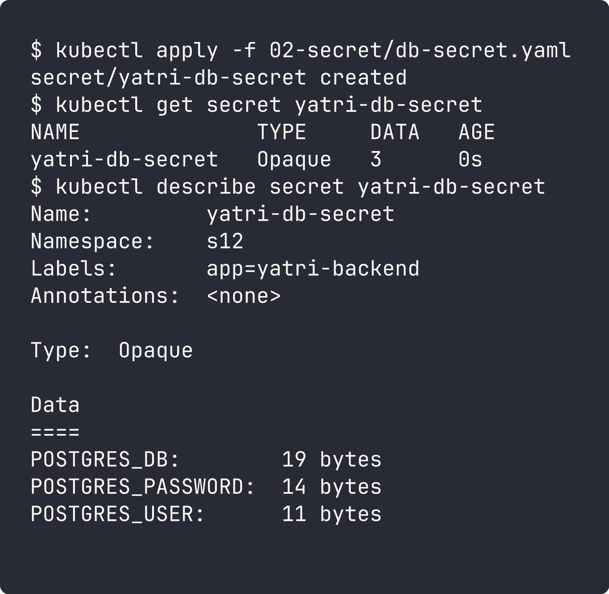

**Inject and verify inside the container** - injected using `secretRef` in the same deployment. The values show up as plain text inside the pod, and the stored value can be decoded by anyone with read access.

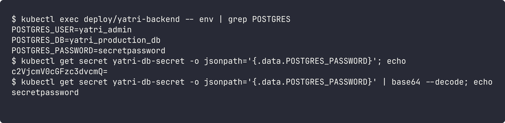

**Why Secrets should not be committed to Git**

- Secret data is only **base64 encoded, not encrypted**. Anyone can decode it with `base64 --decode` as shown above.
- Git keeps history forever. Even if the file is deleted later, the password is still in old commits and forks.
- Repos get shared, cloned, and sometimes made public by mistake, and bots scan GitHub for leaked credentials.
- Better options: create secrets with `kubectl create secret` from CI/CD variables, use Sealed Secrets / SOPS (encrypted in git), or an external store like AWS Secrets Manager or Vault with External Secrets Operator. Also enable encryption at rest for etcd and use RBAC to limit who can read secrets.

(The `db-secret.yaml` in this repo is only demo data.)

# Task 3: Ingress

YAML: [04-full-demo/](04-full-demo/) (configmap, secret, frontend, backend, ingress)

**Ingress controller (minikube addon)**

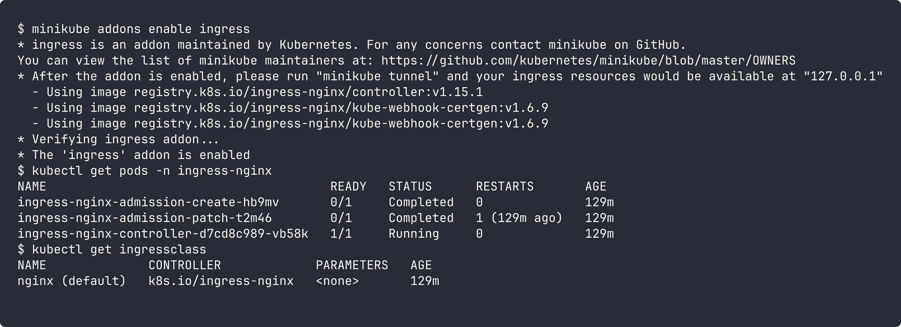

**Deploy application, create services, configure ingress**

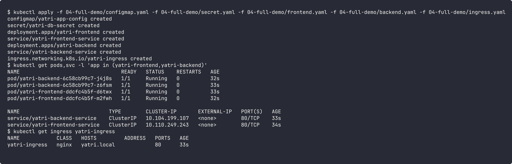

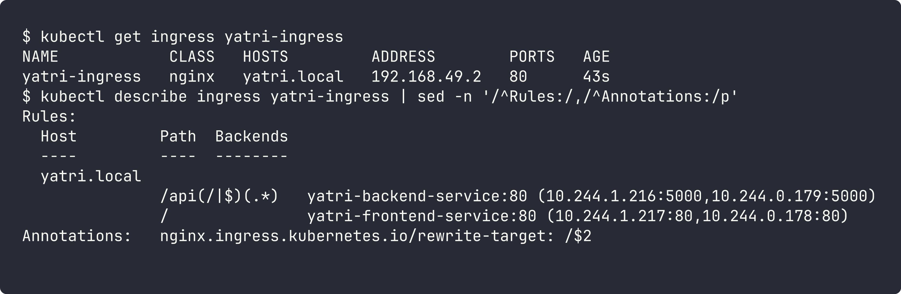

**Access the app through Ingress and verify routing**

On Mac with the docker driver, the node IP is not reachable from the host, so I tested from inside the minikube node using `--resolve` (same as putting `yatri.local` in `/etc/hosts`).

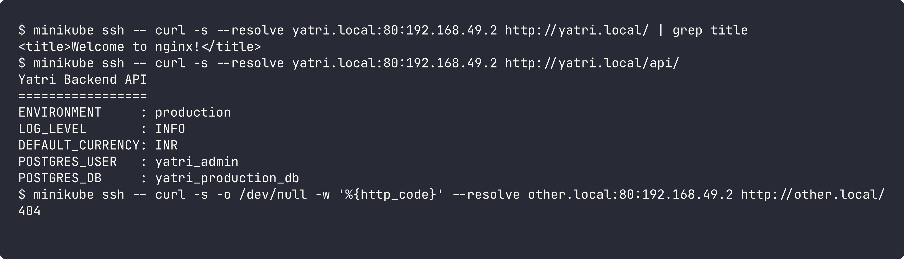

- `yatri.local/` -> frontend (nginx page)
- `yatri.local/api/` -> backend (the python API shows ConfigMap + Secret values)
- unknown host -> 404 from the ingress controller default backend

# Task 4: Ingress vs Ingress Controller

**What is Ingress?**
A Kubernetes resource (YAML) that has HTTP/HTTPS routing rules: which host and path should go to which Service. It also holds TLS settings. On its own it does nothing, it is just a set of rules saved in the API server.

**What is an Ingress Controller?**
An actual application (pods) running in the cluster, like ingress-nginx, Traefik, HAProxy or AWS Load Balancer Controller. It watches Ingress objects and configures a real reverse proxy / load balancer with those rules, then receives the outside traffic and sends it to the services.

**Difference**

| | Ingress | Ingress Controller |
|---|---|---|
| What | config / rules | running software |
| Created by | us, with YAML | installed once (helm, addon) |
| Does traffic? | no | yes, it is the proxy |
| Example | `yatri-ingress` | `ingress-nginx-controller` pod |

**Why both are required**
Without a controller, an Ingress is never applied (no ADDRESS, no routing). Without Ingress objects, the controller has no rules and just returns 404. `ingressClassName: nginx` connects the two.

**Examples**
- ingress-nginx in minikube (used above) with `yatri-ingress`
- AWS ALB Ingress Controller, which creates an Application Load Balancer for each Ingress
- Traefik in k3s

# Task 5: Troubleshooting

Folder: [troubleshooting/](troubleshooting/) - the trailing newline Secret bug ([secret-base64-gotcha.md](troubleshooting/secret-base64-gotcha.md)). I made [broken-secret.yaml](troubleshooting/broken-secret.yaml), [fixed-secret.yaml](troubleshooting/fixed-secret.yaml) and a small [app-pod.yaml](troubleshooting/app-pod.yaml) that checks the password like a DB login would.

**1. Identify the problem (before)** - app says login failed even though the password "is correct".

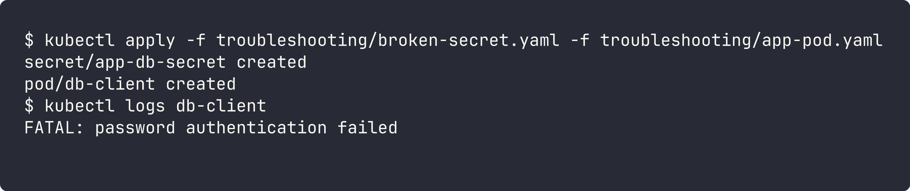

**2 & 3. Troubleshooting commands and root cause** - the secret is 11 bytes but `mypassword` is 10. `od -c` shows an extra `\n` at the end. It came from `echo "mypassword" | base64`, because echo adds a newline. With `-n` the base64 is different (`...ZA==` instead of `...ZAo=`).

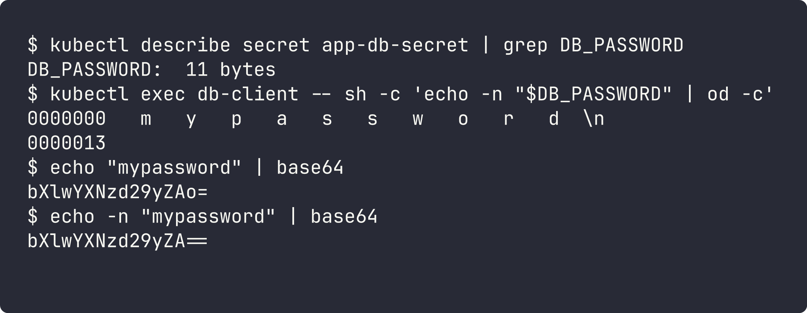

**4 & 5. Fix and after output** - used `echo -n` to make the value and applied the fixed secret. Env vars from a secret are only read when the pod starts, so the pod has to be recreated.

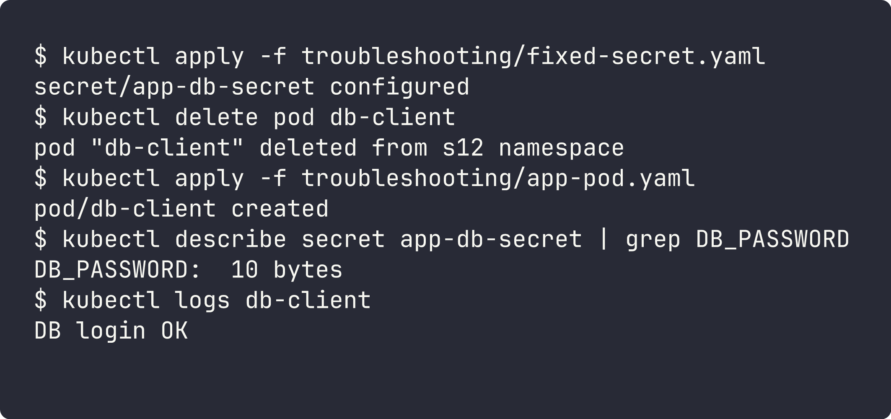
