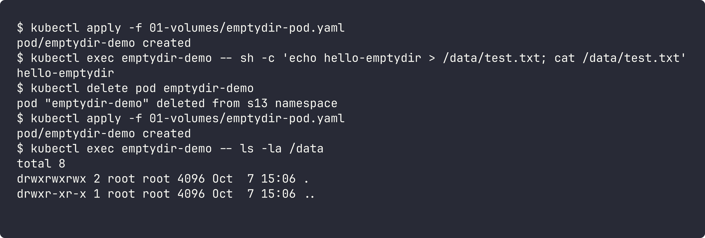
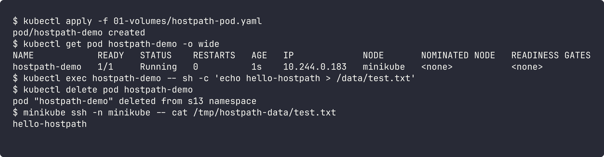
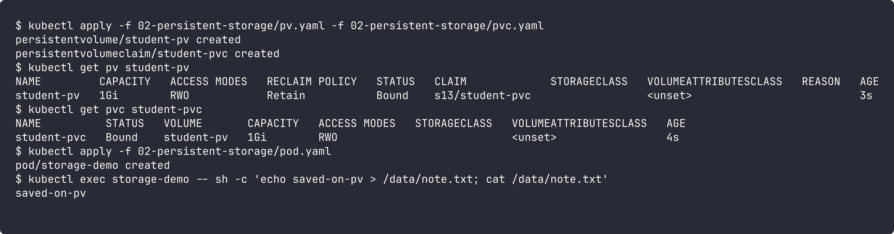
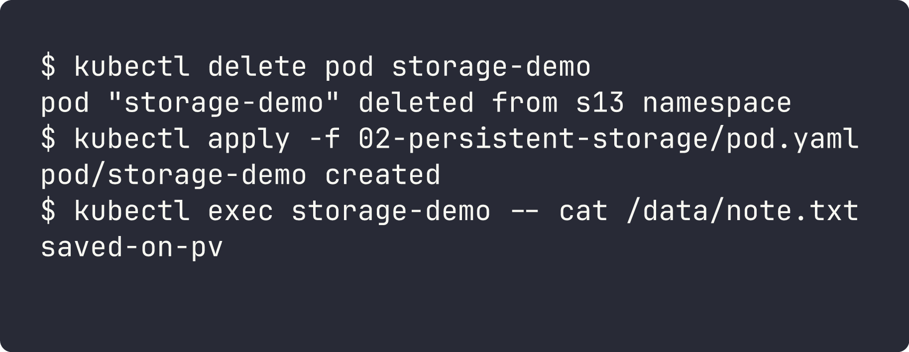
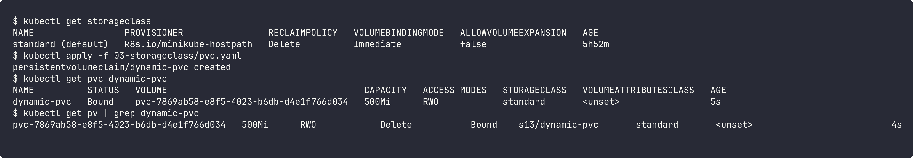

# Kubernetes Volumes

Container filesystem is temporary. When a container restarts, everything written inside it is gone. Volumes are used to keep or share data.

## emptyDir

- Created empty when the pod starts, deleted when the pod is deleted.
- All containers in the same pod can share it.
- Survives container restart, but **not** pod deletion.
- Use: cache, temp files, sharing files between main container and sidecar.

YAML: [../01-volumes/emptydir-pod.yaml](../01-volumes/emptydir-pod.yaml)

After deleting and recreating the pod, `/data` is empty again.

## hostPath

- Mounts a folder from the node (host machine) into the pod.
- Data stays on that node even after the pod is deleted.
- Problem: data is tied to one node. If the pod moves to another node, it sees a different folder. Also a security risk (pod can touch node files).
- Use: node-level agents (log collectors, monitoring), local testing.

YAML: [../01-volumes/hostpath-pod.yaml](../01-volumes/hostpath-pod.yaml)

The pod is deleted but the file is still on the `minikube` node at `/tmp/hostpath-data`.

## PersistentVolume (PV)

- A piece of storage in the cluster, created by an admin (static) or by a StorageClass (dynamic).
- It is a cluster-level resource, not in any namespace.
- Has capacity, access modes (`ReadWriteOnce`, `ReadOnlyMany`, `ReadWriteMany`) and a reclaim policy (`Retain`, `Delete`).

## PersistentVolumeClaim (PVC)

- A request for storage made by the user/app ("I need 500Mi RWO").
- Kubernetes binds the PVC to a matching PV. The pod only refers to the PVC name, so the app does not care where the storage actually is.

Static PV + PVC: [../02-persistent-storage/](../02-persistent-storage/)

Note: the given `pvc.yaml` had no `storageClassName`, so minikube's default StorageClass created a new dynamic volume and `student-pv` stayed `Available`. I added `storageClassName: ""` to the PVC so it binds to the static PV.

Deleted the pod and created it again, and the data is still there:

## StorageClass

- Describes a "type" of storage and which provisioner creates it (for example AWS EBS gp3, or `k8s.io/minikube-hostpath` in minikube).
- Also sets reclaim policy, volume binding mode, and whether expansion is allowed.
- One StorageClass can be marked as default.

## Dynamic provisioning

- No need to create PVs by hand. The PVC asks for a StorageClass and the provisioner creates the PV automatically.
- When the PVC is deleted, the PV is also deleted if reclaimPolicy is `Delete`.

YAML: [../03-storageclass/pvc.yaml](../03-storageclass/pvc.yaml)

The PV `pvc-7869...` was created automatically for `dynamic-pvc`.

## Summary

| Type | Lifetime | Shared across nodes | Typical use |
|---|---|---|---|
| emptyDir | pod | no | temp/cache, sidecar sharing |
| hostPath | node | no | node agents, testing |
| PV/PVC (static) | independent of pod | depends on backend | admin managed storage |
| StorageClass (dynamic) | independent of pod | depends on backend | normal choice in cloud (EBS, EFS...) |
