# Session 13 - Storage, HPA & Probes Homework

Namespace `s13` for Task 1 and 2, and `production-webapp` for the mini project. Metrics server is enabled (`minikube addons enable metrics-server`).

# Task 1: Kubernetes Volumes

Documented in [01-kubernetes-volumes/README.md](01-kubernetes-volumes/README.md) with examples for emptyDir, hostPath, PV, PVC, StorageClass and dynamic provisioning.

# Task 2: HPA Hands-on

Files: [04-hpa/deployment.yaml](04-hpa/deployment.yaml), [04-hpa/service.yaml](04-hpa/service.yaml), [04-hpa/hpa.yaml](04-hpa/hpa.yaml), and the load generator I made: [04-hpa/load-generator.yaml](04-hpa/load-generator.yaml) (3 busybox pods calling the service in a loop).

HPA: min 1, max 5, target 50% CPU (of the 100m request).

**1. Deploy the application**

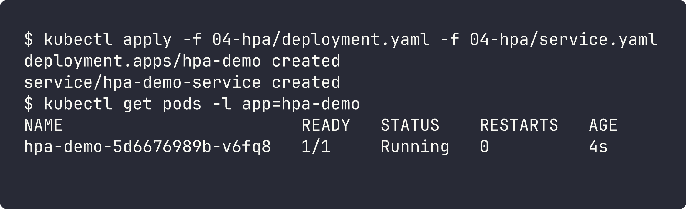

**2 & 3. Configure and verify HPA** - 0% CPU at idle, 1 replica.

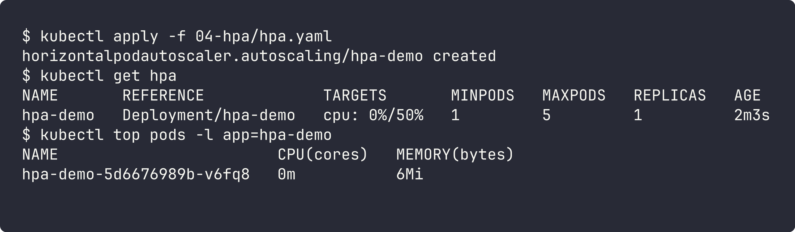

**4 & 5. Deploy load generator and increase load**

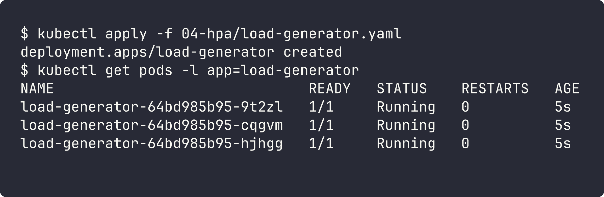

**6 & 7. Observe CPU utilization and pod scaling**

CPU went to 138%, so HPA scaled from 1 to 3 pods. After that the load got spread out and CPU came down to around 25-57%.

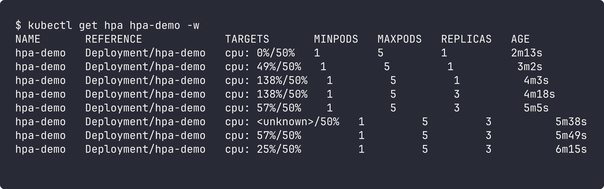

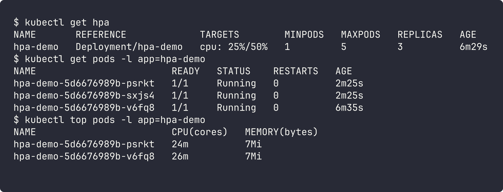

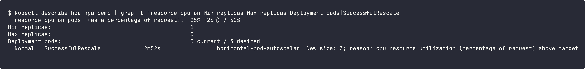

**Scale down after removing the load**

```bash
kubectl delete -f 04-hpa/load-generator.yaml
```

After the 5 min stabilization window it went 3 -> 2 -> 1:

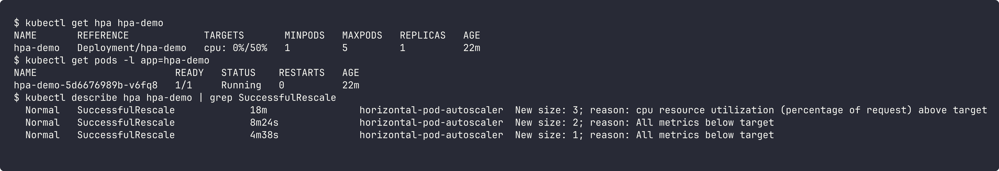

Formula HPA uses: `desired = ceil(current replicas * current CPU / target CPU)` = ceil(1 * 138 / 50) = 3.

# Task 3: Mini Project

Files: [mini-project/](mini-project/) (namespace, pvc, deployment with startup/readiness/liveness probes, service, hpa)

**Deploy everything**

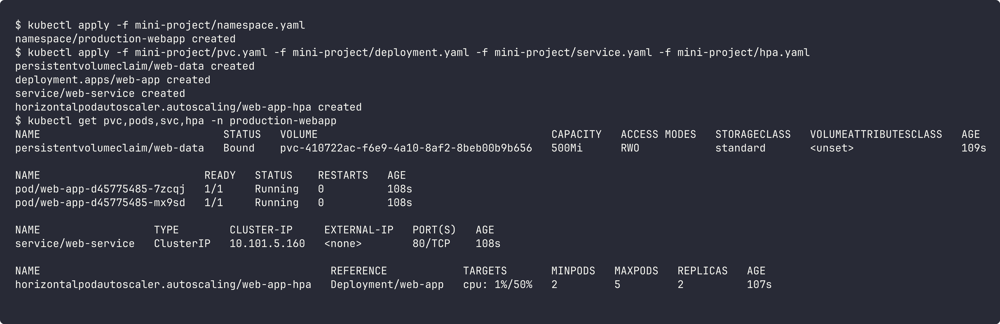

**Storage persistence** - wrote a file to `/data`, deleted the pod, and read it from the new pod.

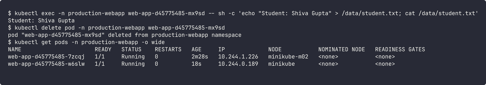

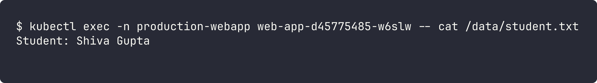

Note: minikube's hostpath provisioner keeps data on one node, so on my 2 node cluster I checked the new pod that came up on the same node (`minikube`). On a cloud cluster with EBS the volume would move with the pod.

**Service**

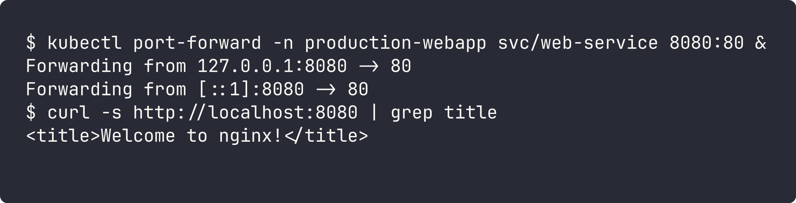

**Probes and volume mount**

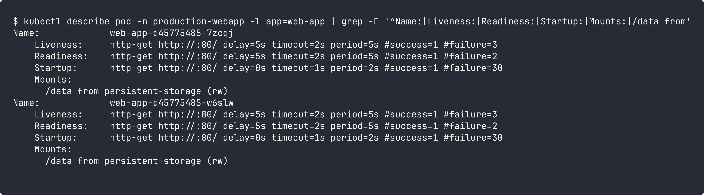

- startup probe: gives nginx up to 60s (30 x 2s) to start before other probes run
- readiness probe: pod gets traffic only when `/` returns 200
- liveness probe: restarts the container if `/` fails 3 times

**HPA scaling** - ran 8 load generator pods to push CPU above the 50% target.

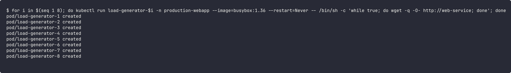

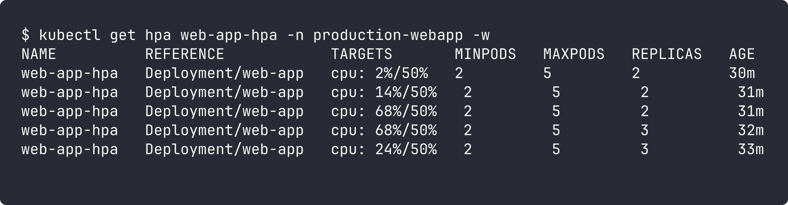

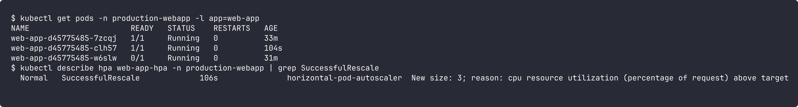

CPU hit 68% and HPA scaled from 2 to 3 pods. Under this heavy load one pod showed `0/1` because its readiness probe (2s timeout) failed, so it was taken out of the service until it could answer again. This is the readiness probe doing its job.

Cleanup:

```bash
kubectl delete pod -n production-webapp -l run
```
