# Session 14 - Kubernetes Troubleshooting Homework

Everything is done in namespace `s14`.

# Task 1: Kubernetes Commands

Pods used: [01-kubectl-get/pod.yaml](01-kubectl-get/pod.yaml), [02-kubectl-describe/demo-pod.yaml](02-kubectl-describe/demo-pod.yaml), [03-kubectl-logs/pod.yaml](03-kubectl-logs/pod.yaml), [04-kubectl-exec/pod.yaml](04-kubectl-exec/pod.yaml)

**kubectl get** - quick status of resources (READY, STATUS, RESTARTS).

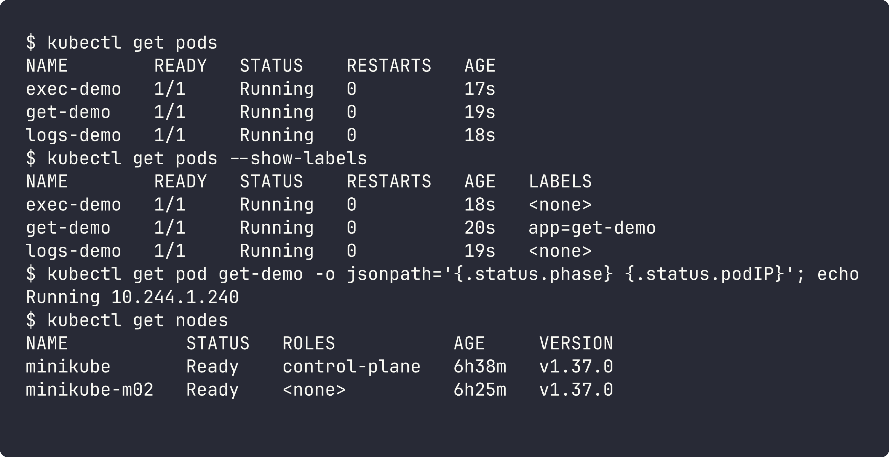

**kubectl get -o wide** - also shows pod IP and the node it runs on.

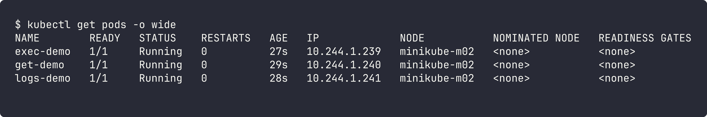

**kubectl describe** - full details of one object: node, IP, image, container state, and events at the bottom.

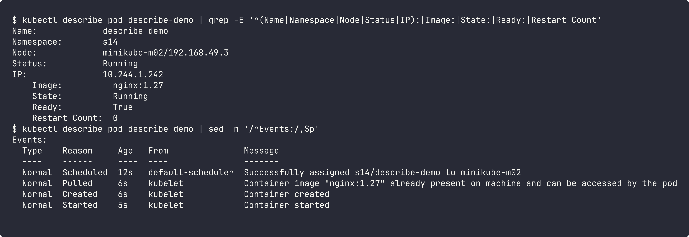

**kubectl logs** - stdout/stderr of the container. `--tail`, `--since`, `-f`, `--previous` are useful.

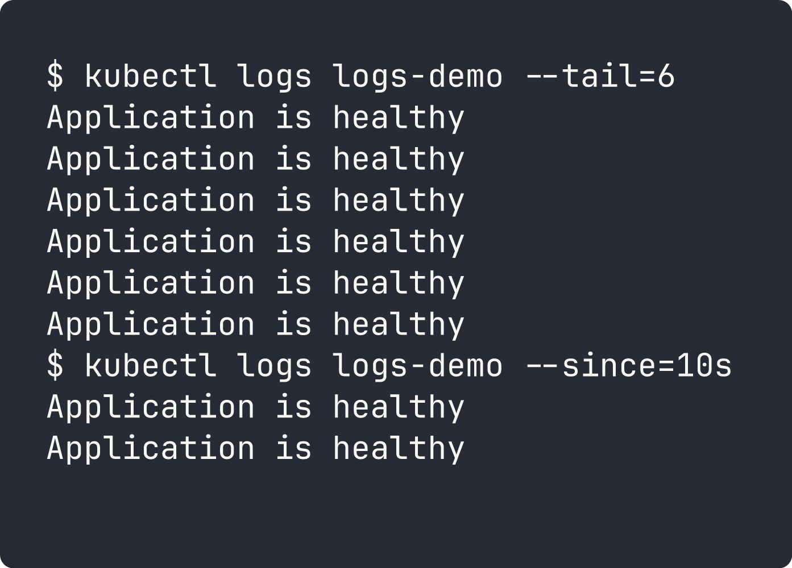

**kubectl exec** - run a command inside the container to check files, processes and connectivity from inside.

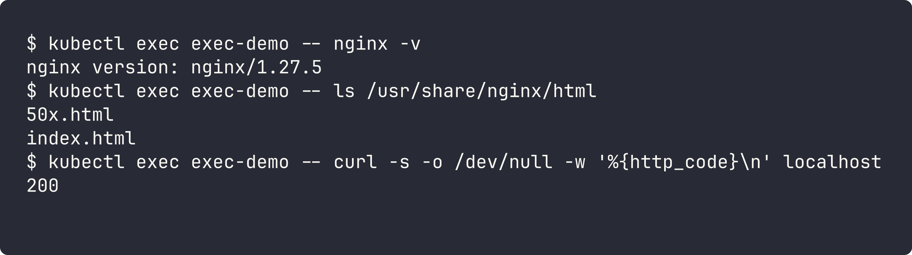

**kubectl events** - what happened in the cluster (scheduling, pulling, failures).

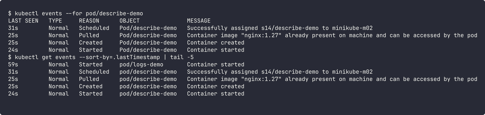

**kubectl explain** - docs for any field of a resource, right from the terminal.

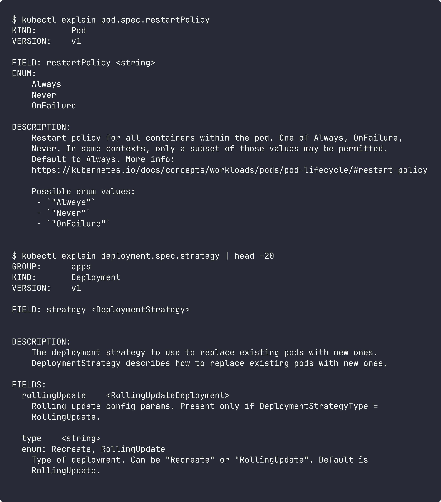

**kubectl top** - CPU/memory usage of nodes and pods (needs metrics-server).

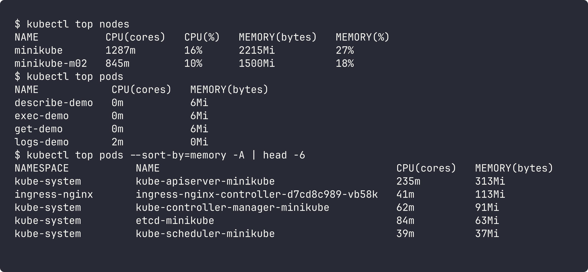

# Task 2: Troubleshoot Common Issues

For every issue: identify -> investigate -> root cause -> fix -> verify.

## 1. CrashLoopBackOff

Files: [06-crashloopbackoff/](06-crashloopbackoff/)

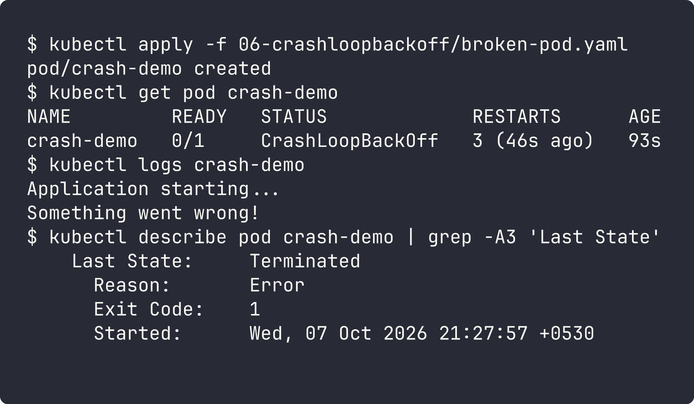

- **Problem:** pod keeps restarting, status CrashLoopBackOff.
- **Investigation:** `logs` shows "Something went wrong!", `describe` shows Last State Terminated, Exit Code 1.
- **Root cause:** the app command exits with code 1. restartPolicy is Always, so kubelet keeps restarting it with backoff.
- **Fix:** used the fixed command that keeps the app running.

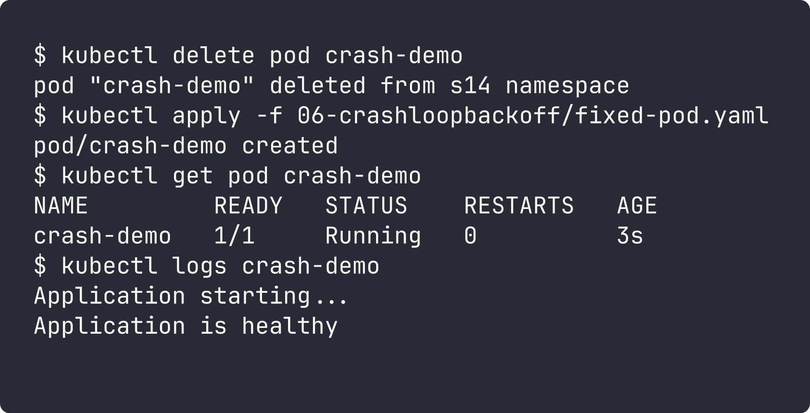

## 2. ErrImagePull / ImagePullBackOff

Files: [07-imagepullbackoff/](07-imagepullbackoff/)

- **Problem:** first `ErrImagePull`, then after retries it changes to `ImagePullBackOff` (kubelet waits longer between retries).
- **Investigation:** `describe` events: `nginx:this-image-does-not-exist: not found`.
- **Root cause:** wrong image tag.
- **Fix:** used `nginx:1.27`.

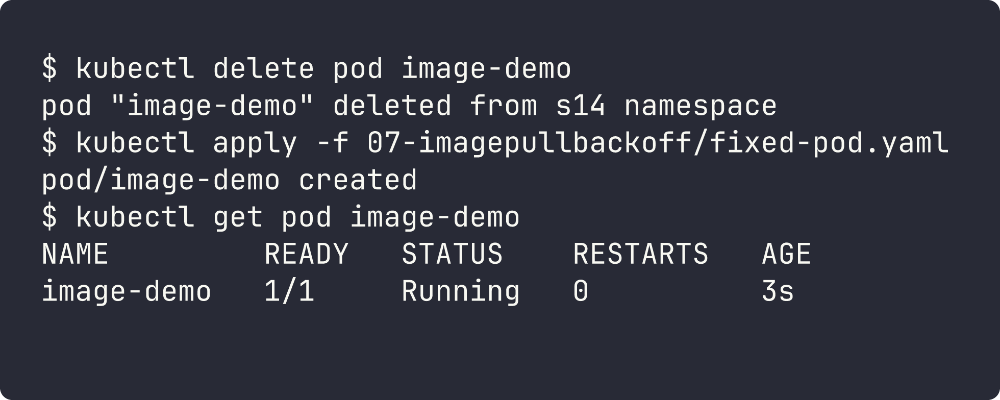

## 3. Pending

Files: [08-pending-pods/](08-pending-pods/)

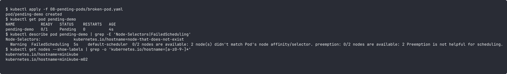

- **Problem:** pod stays Pending, no node assigned.
- **Investigation:** `FailedScheduling: 2 node(s) didn't match Pod's node affinity/selector`.
- **Root cause:** nodeSelector asks for `node-that-does-not-exist`, while my nodes are `minikube` and `minikube-m02`.
- **Fix:** removed the wrong nodeSelector. (Other common reasons: not enough CPU/memory, taints, unbound PVC.)

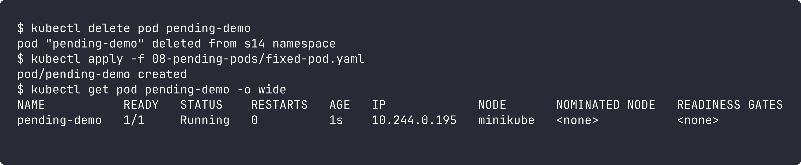

## 4. ContainerCreating

Files: [10-containercreating/](10-containercreating/) (made by me)

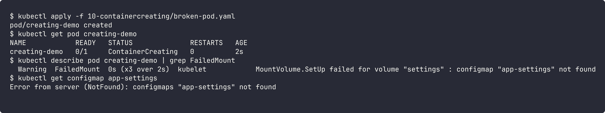

- **Problem:** pod stuck in ContainerCreating.
- **Investigation:** event `FailedMount ... configmap "app-settings" not found`.
- **Root cause:** pod mounts a ConfigMap volume that does not exist.
- **Fix:** created the ConfigMap. kubelet retries the mount, so the pod started on its own without recreating it.

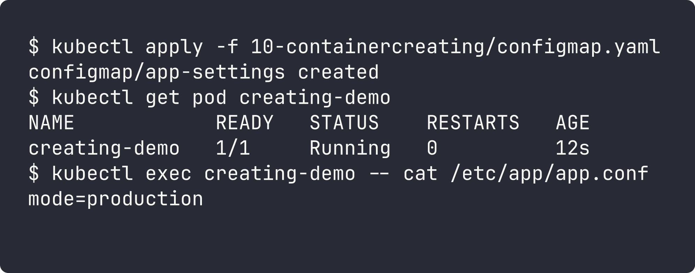

## 5. Service connectivity issue

Files: [09-service-dns-troubleshooting/deployment.yaml](09-service-dns-troubleshooting/deployment.yaml), [service.yaml](09-service-dns-troubleshooting/service.yaml)

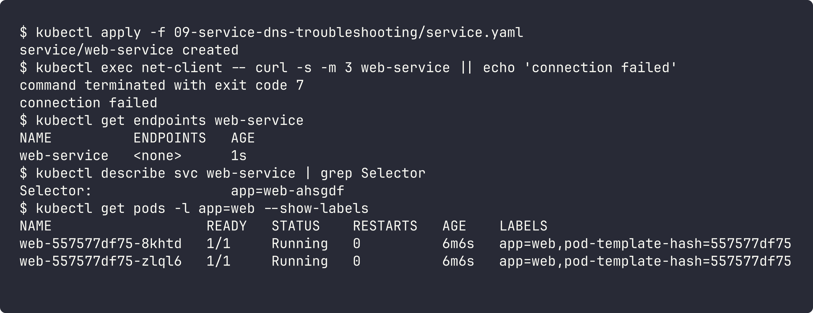

- **Problem:** curl to `web-service` fails.
- **Investigation:** endpoints `<none>`. Service selector is `app=web-ahsgdf` but pods have `app=web`.
- **Root cause:** selector does not match pod labels, so the service has no backends.
- **Fix:** changed the selector to `app=web`.

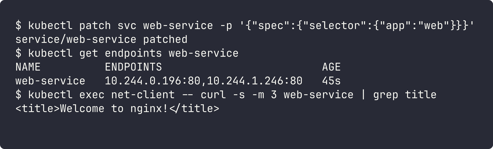

## 6. DNS issue

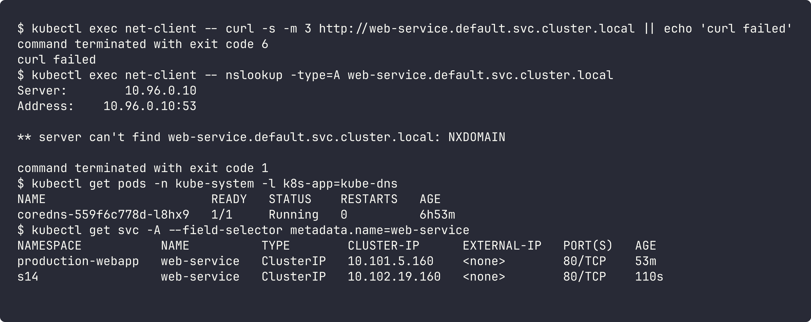

- **Problem:** app calls `web-service.default.svc.cluster.local` and the name doesn't resolve (curl exit code 6).
- **Investigation:** `nslookup` gives NXDOMAIN. CoreDNS is running, so DNS itself is fine. `kubectl get svc -A` shows `web-service` is in `s14`, not `default`.
- **Root cause:** wrong namespace in the FQDN.
- **Fix:** use `web-service.s14.svc.cluster.local` (or just `web-service` from the same namespace).

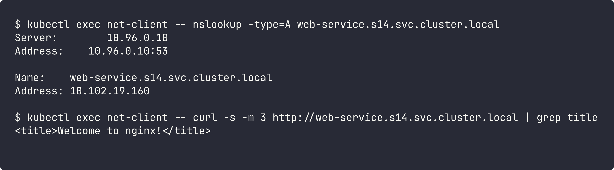

Note: the given `dns-test-pod.yaml` image (`dnsutils:1.3`) is not found in registry.k8s.io anymore, so I used a curl image pod (it has `nslookup`).

## 7. Pod networking issue

Files: [11-pod-networking/](11-pod-networking/) (made by me)

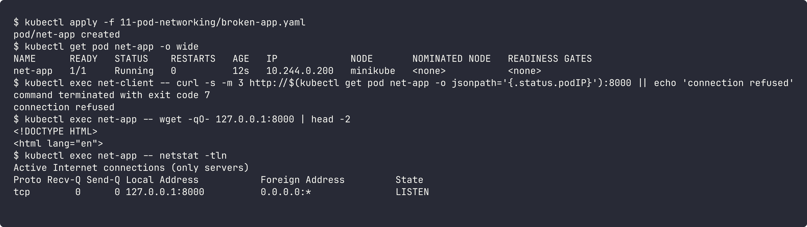

- **Problem:** pod is Running and 1/1, but other pods get "connection refused" on its IP:8000.
- **Investigation:** from inside the pod `127.0.0.1:8000` works. `netstat` shows it listens on `127.0.0.1:8000` only.
- **Root cause:** app is bound to localhost, so it only accepts connections from inside its own pod.
- **Fix:** bind to `0.0.0.0`.

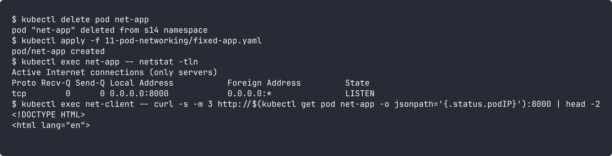

## 8. Configuration issue

Files: [12-config-issue/](12-config-issue/) (made by me)

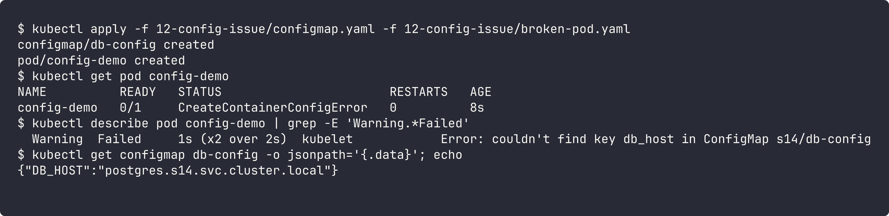

- **Problem:** pod in `CreateContainerConfigError`.
- **Investigation:** event says `couldn't find key db_host in ConfigMap s14/db-config`. The ConfigMap has `DB_HOST`.
- **Root cause:** wrong key name (keys are case sensitive).
- **Fix:** use `key: DB_HOST`.

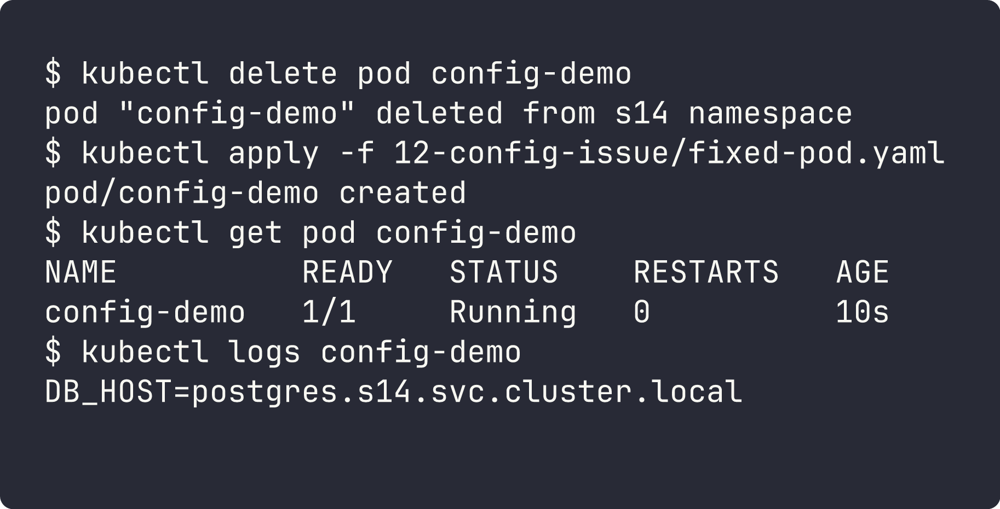

# Task 3: Mini Project

Files: [mini-project/](mini-project/)

**1. Deploy**

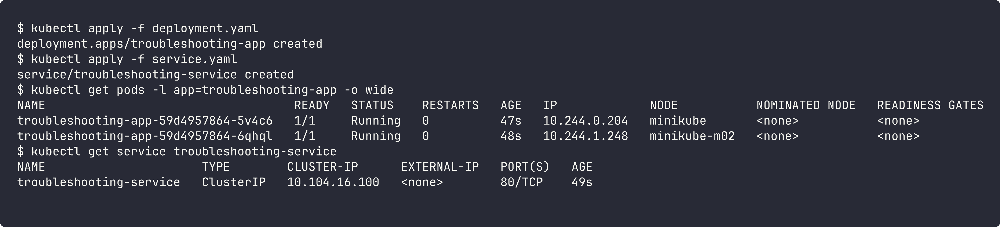

**2. Check the application**

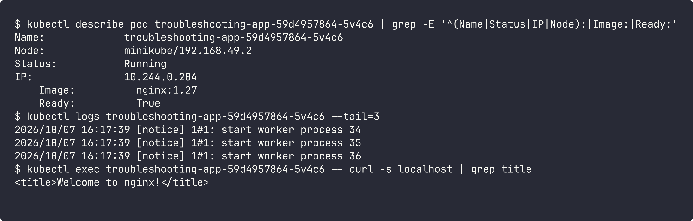

**3 & 4. Check service and endpoints**

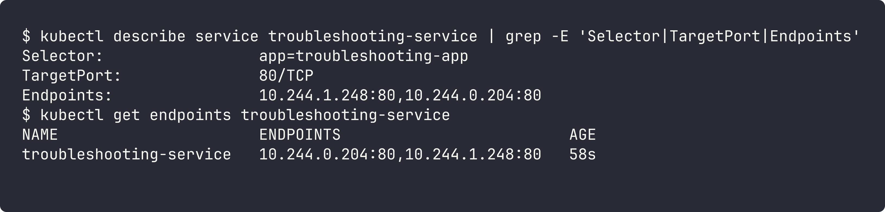

**5 & 6. Broken pod**

**7. Answers**

1. Pod status: `ImagePullBackOff` (and `ErrImagePull` before that).
2. Actual error: `failed to resolve reference "docker.io/library/nginx:this-tag-does-not-exist": not found`.
3. Command: `kubectl describe pod project-broken-pod` (Events section).
4. The tag `this-tag-does-not-exist` does not exist for the nginx image on Docker Hub.
5. Use a real tag. Image is one of the few pod fields you can change, so I did it in place:

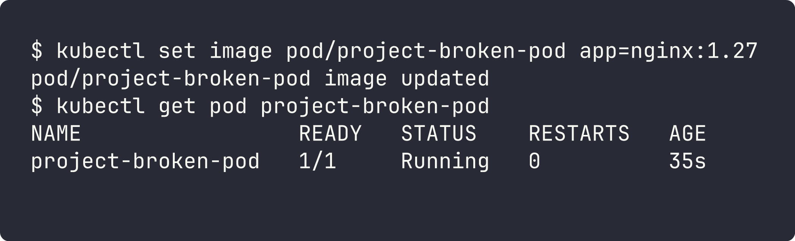

**8 & 9. Service selector challenge**

Changed the selector to `app: wrong-app`. Endpoints became `<none>`, and the pod label `app=troubleshooting-app` did not match the selector `app=wrong-app`.

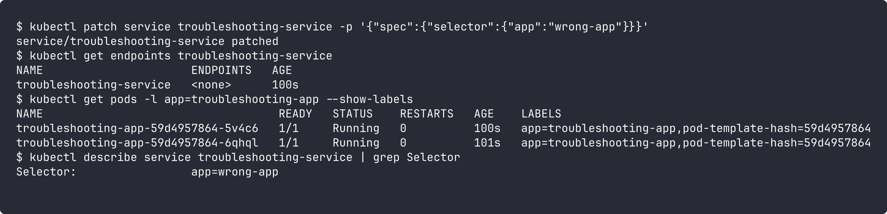

Fixed by applying the correct `service.yaml` again:

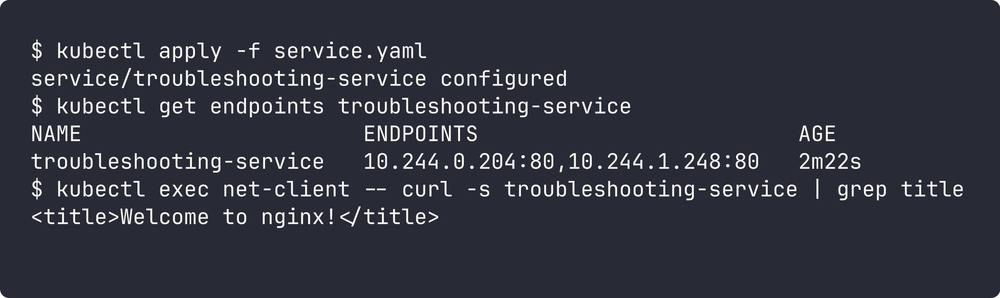

**11. Troubleshooting table**

| Problem | What I Saw | Command I Used | Root Cause | Fix |
| :--- | :--- | :--- | :--- | :--- |
| Broken Pod | `0/1 ImagePullBackOff` | `kubectl get pod`, `kubectl describe pod` | image tag does not exist | `kubectl set image` to `nginx:1.27` |
| Service Problem | endpoints `<none>`, curl fails | `kubectl get endpoints`, `kubectl get pods --show-labels`, `kubectl describe svc` | selector `app=wrong-app` doesn't match pod label | set selector back to `app: troubleshooting-app` |
| Image Problem | `ErrImagePull` then `ImagePullBackOff` | `kubectl describe pod` events | `not found` from Docker Hub | correct image name/tag |

**12. README questions**

1. **kubectl get:** a quick list of resources and their current status (ready count, status, restarts, age).
2. **get vs describe:** `get` is a one line summary of many objects. `describe` is the full details of one object, including events.
3. **kubectl logs:** to see what the app printed (errors, stack traces), especially why it crashed.
4. **kubectl exec:** when the pod is running and I need to check from inside, like files, env vars, `curl localhost`, or DNS.
5. **CrashLoopBackOff:** the container starts and then exits/crashes again and again, so kubelet waits longer each time before restarting it.
6. **ImagePullBackOff:** kubelet can't pull the image (wrong name/tag, private registry without secret, network), so it backs off between retries.
7. **Pending:** the scheduler can't find a node: not enough CPU/memory, nodeSelector/affinity doesn't match, taints, or the PVC is not bound.
8. **No endpoints:** selector doesn't match any pod labels, or matching pods are not Ready.
9. **Selector and labels:** the service sends traffic only to pods whose labels match its selector. That is the only link between them.
10. **Kubernetes DNS:** CoreDNS gives every service a name like `svc.namespace.svc.cluster.local`, so pods can find services by name instead of IP.
