# Session 15 - Helm Homework

Helm v4.3.0, namespace `s15`.

# Task 1: Helm Commands

**helm repo** - add, update and list chart repositories.

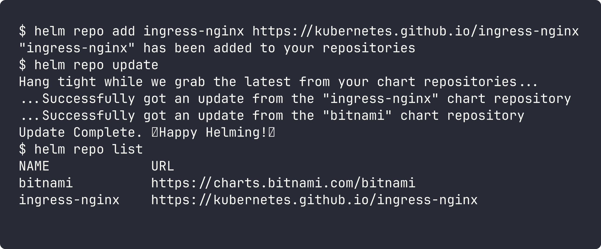

**helm search** - `search repo` looks in added repos, `search hub` looks in Artifact Hub.

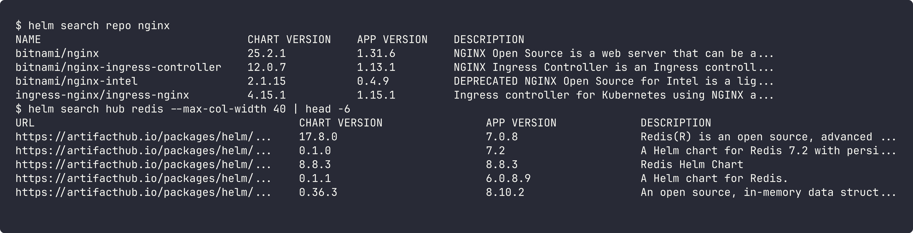

**helm create** - generates a starter chart (Chart.yaml, values.yaml, templates). Chart is in [helm-commands/mychart](helm-commands/mychart).

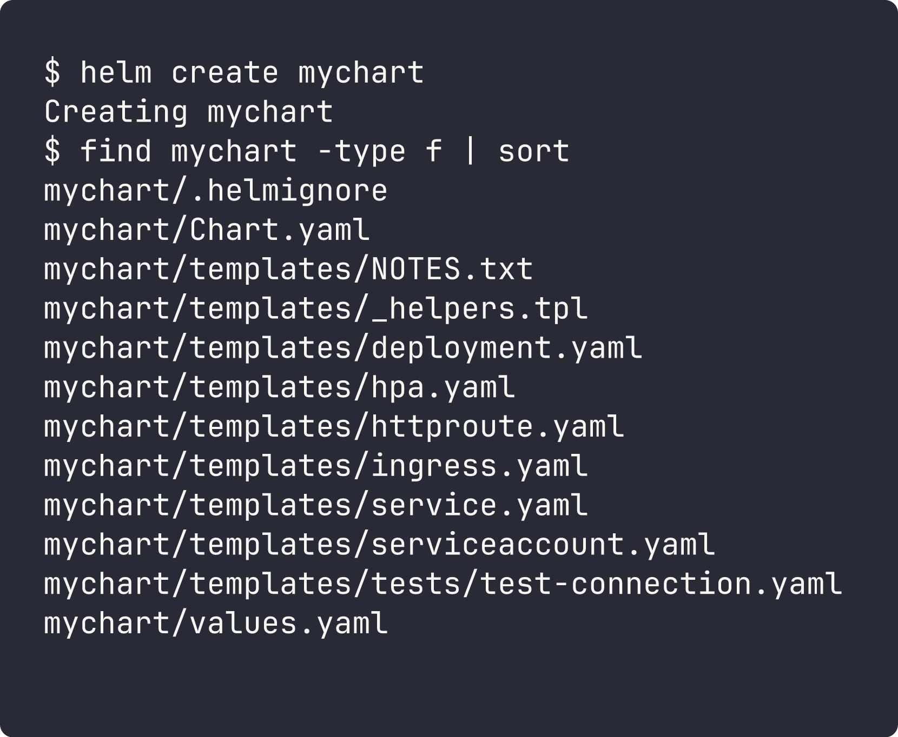

**helm install** - renders templates with values and creates a release (revision 1).

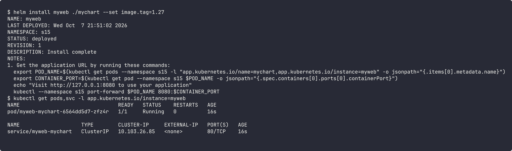

**helm list / helm status** - list releases and show status of one release.

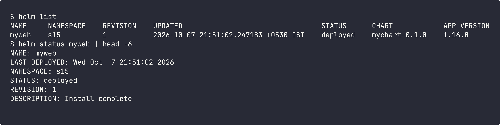

**helm get** - `get values` shows the values I passed (`--all` shows everything), `get manifest` shows the final YAML applied.

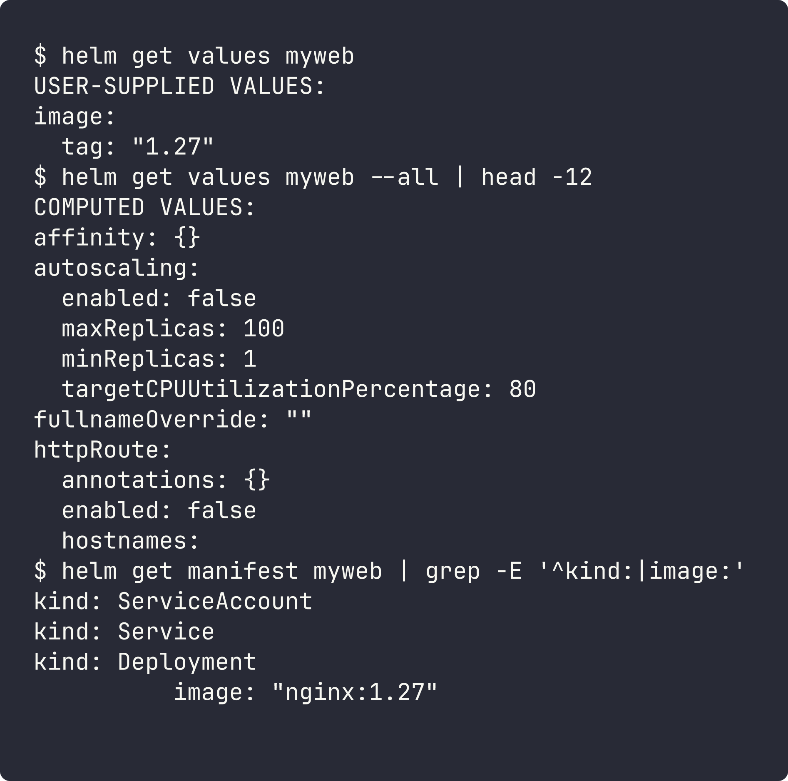

**helm upgrade / helm history** - upgrade changes the release and adds a new revision. History shows all revisions.

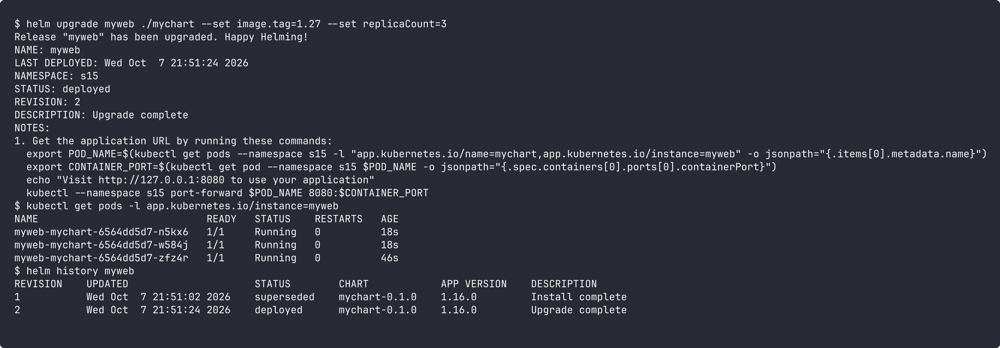

**helm rollback** - goes back to an old revision. It creates a new revision ("Rollback to 1"), it does not delete history.

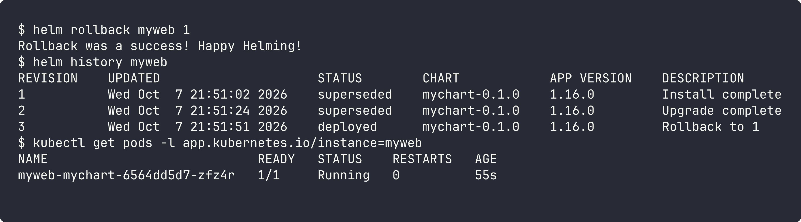

**helm uninstall** - deletes all resources of the release.

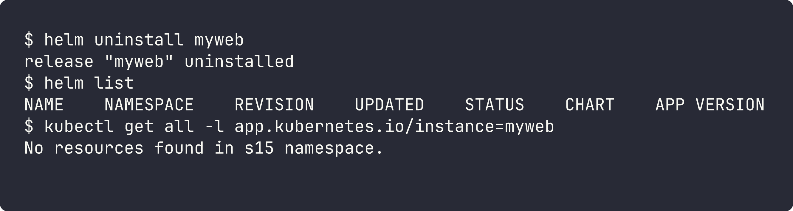

# Task 2: Helm Rollback

Chart: [07-install-upgrade/app-chart](07-install-upgrade/app-chart) (nginx, default tag 1.24)

**Install -> verify** (rev 1, nginx 1.24)

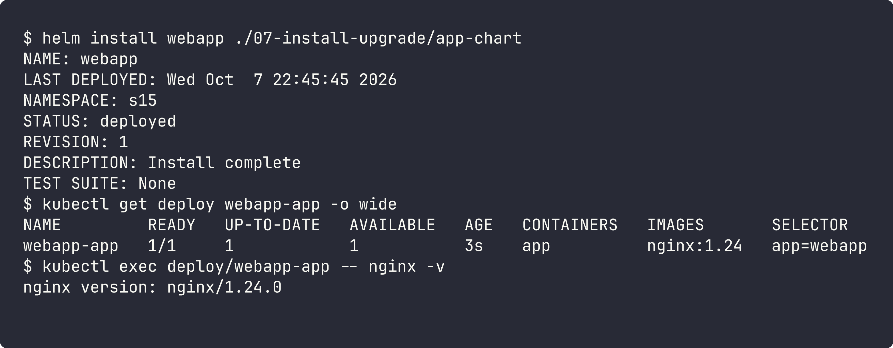

**Upgrade -> verify** (rev 2, nginx 1.25)

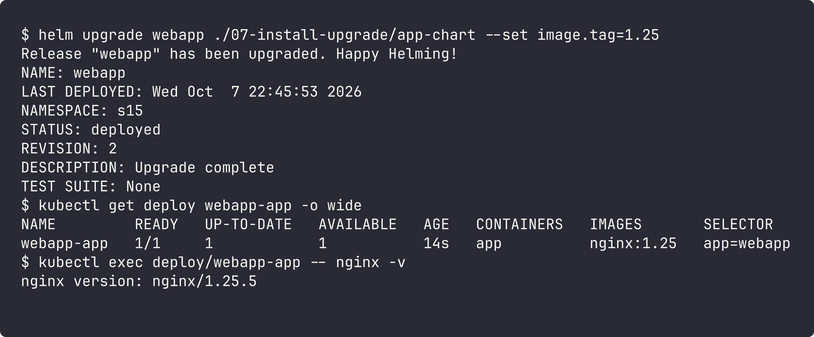

**Upgrade again -> verify** (rev 3, nginx 1.27, 3 replicas)

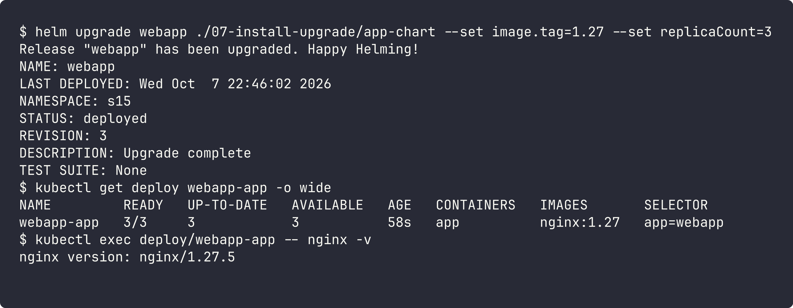

**Rollback -> verify** (back to rev 2: nginx 1.25, 1 replica)

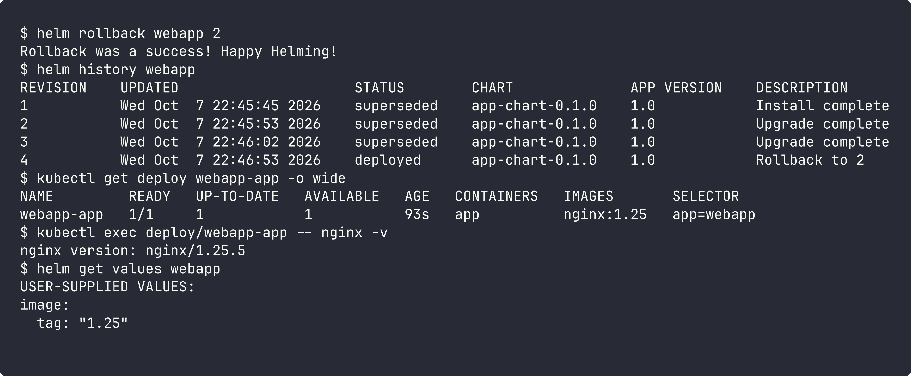

The rollback created revision 4 with the same values as revision 2 (`image.tag=1.25`). Image and replica count both went back.

# Task 3: Mini Project - Notes App chart

Chart: [mini-project/notes-chart](mini-project/notes-chart) (Chart.yaml, values.yaml, values-prod.yaml, templates for deployment, service, configmap)

**Lint and render**

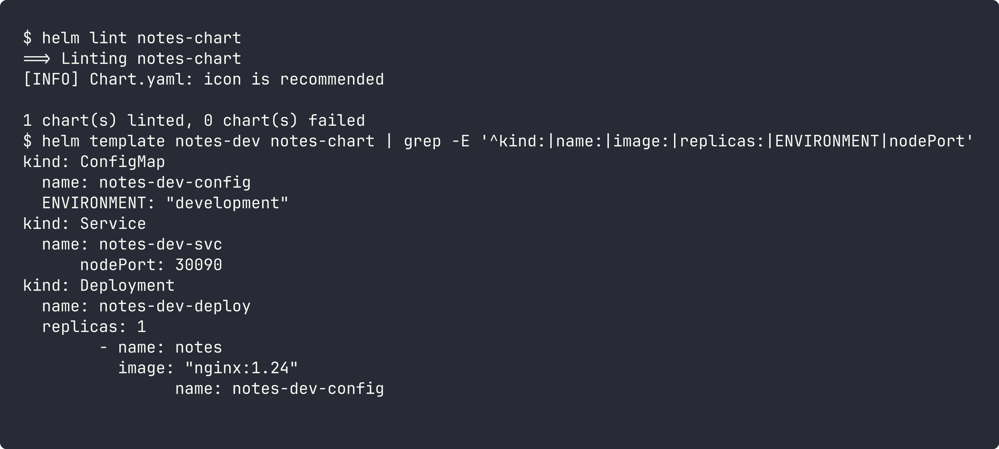

**Install (development values)** - 1 replica, nginx 1.24, ENVIRONMENT=development, NodePort 30090

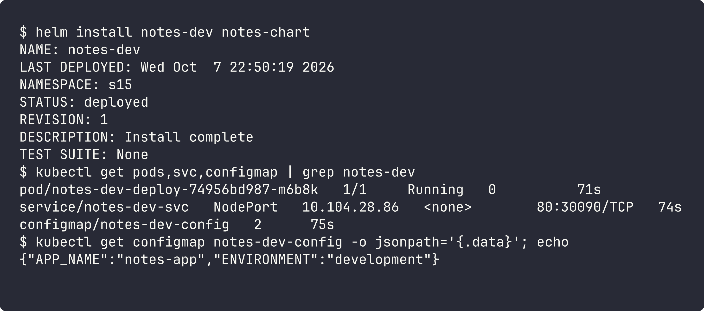

**Upgrade with production values** - 3 replicas, nginx 1.25, ENVIRONMENT=production

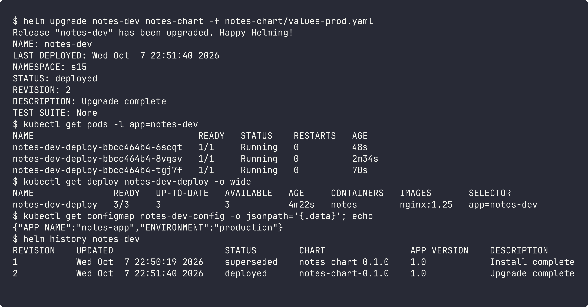

**Bad upgrade** - broken image tag. The new pod is in ImagePullBackOff, but the old pods keep running because of the rolling update, so the app is still up.

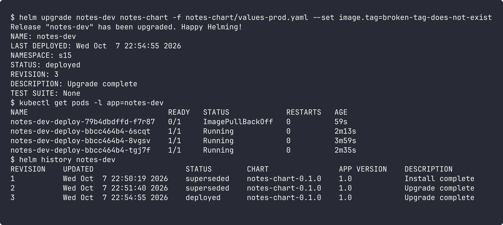

**Rollback to revision 2** - the broken pod is terminating and the 3 good pods stay.

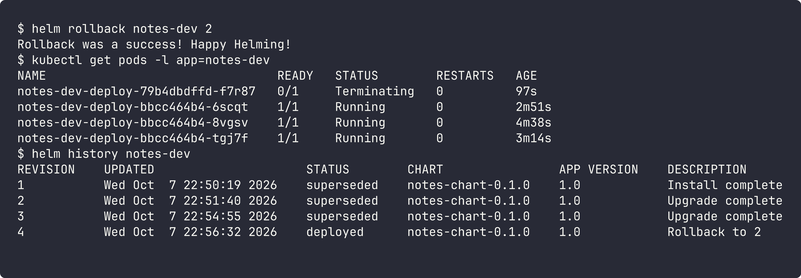

**Clean up**

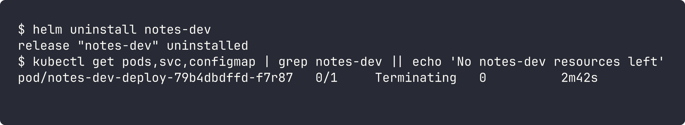

The release is removed. The pod from the bad upgrade is still shutting down (Terminating) and is deleted a few seconds later.
