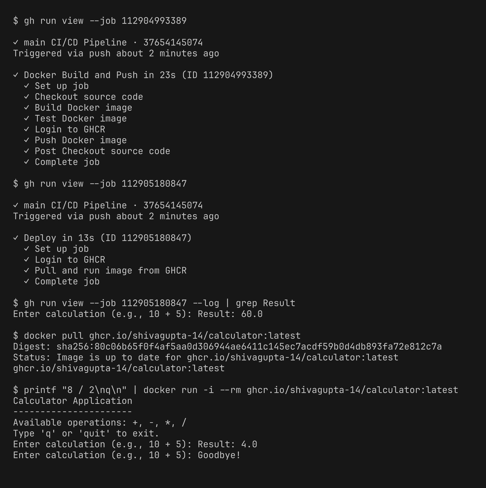

# Session 16 - CI/CD & GitHub Actions Homework

Demo project: a small Python calculator app with a full CI/CD pipeline on GitHub Actions.

GitHub repo (where the pipeline runs): https://github.com/ShivaGupta-14/session16-cicd-github-actions

Code is also in [mini-project/](mini-project/)

| Deliverable | File |
|---|---|
| Application source code | [app/calculator.py](mini-project/app/calculator.py) |
| Unit tests | [tests/test_calculator.py](mini-project/tests/test_calculator.py) |
| Build script | [build.sh](mini-project/build.sh) |
| Dockerfile | [Dockerfile](mini-project/Dockerfile) |
| GitHub Actions workflow (CI + CD) | [.github/workflows/ci.yml](mini-project/.github/workflows/ci.yml) |

## Concepts

- **CI vs CD** - CI = every push is automatically tested and built. CD = the tested build is packaged and delivered/deployed automatically.
- **CI/CD pipeline** - the chain of stages: test -> security check -> build -> docker image -> push -> deploy. If one stage fails, the next ones don't run.
- **GitHub Actions** - CI/CD service built into GitHub. Workflows are YAML files in `.github/workflows/`.
- **Workflow** - `ci.yml`, triggered on `push` to main, `pull_request` and `workflow_dispatch` (manual).
- **Jobs** - `test`, `security-check`, `build`, `docker`, `deploy`. Order is set with `needs`. `security-check` and `build` run in parallel after `test`.
- **Steps** - commands or actions inside a job (`actions/checkout`, `actions/setup-python`, `run: pytest -v` etc).
- **Runners** - all jobs use `runs-on: ubuntu-latest` (GitHub hosted VM). Each job gets a fresh runner.
- **Secrets** - `secrets.GITHUB_TOKEN` is used to log in to GitHub Container Registry (GHCR). It is never written in the code.
- **Artifacts** - `build/` folder is uploaded as `calculator-build` artifact using `actions/upload-artifact`.
- **Build** - `build.sh` creates the build folder, and `docker build` creates the image.
- **Test** - `pytest` runs 5 unit tests. Build only runs if tests pass.

## Pipeline Flow

```
git push -> Test -> Security Check + Build (artifact) -> Docker Build & Push (GHCR) -> Deploy
            |------------------- CI ------------------|  |--------------- CD ---------------|
```

- **CI part:** test, security-check, build
- **CD part:** `docker` job builds the image, tests it, and pushes it to `ghcr.io/shivagupta-14/calculator`. `deploy` job (environment `production`) pulls the image from GHCR and runs it.

## Running Locally

Before pushing I ran the same steps locally: tests, build script, and docker image.

```bash
pip install -r requirements.txt
pytest -v
./build.sh
docker build -t calculator:local .
printf "10 + 5\nq\n" | docker run -i --rm calculator:local
```


## Pipeline Execution

Pushed to GitHub, the workflow started automatically. All 5 jobs passed and the artifact was uploaded.


## CD: Docker Push and Deploy

Steps of the docker and deploy jobs. The deploy job ran the image and got `Result: 60.0` for `20 * 3`. I also pulled the same image from GHCR on my machine and ran it.


