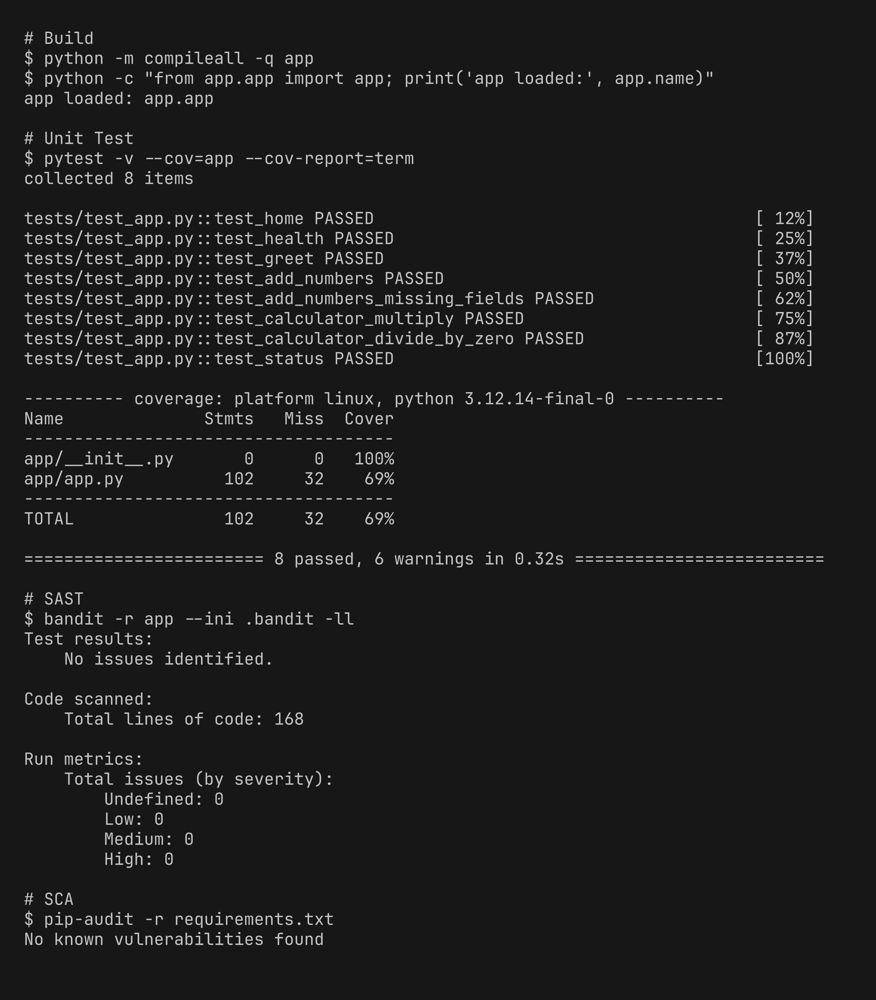
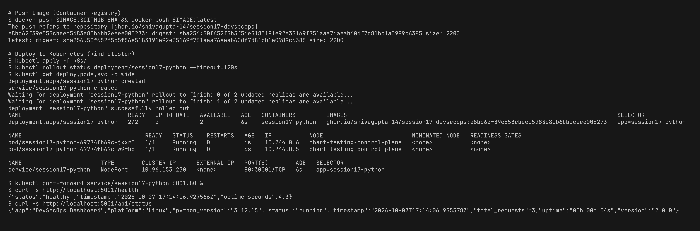

# Session 17 - Complete CI/CD & DevSecOps Homework

Demo project: Flask app (DevSecOps Dashboard) with a full CI/CD + DevSecOps pipeline on GitHub Actions. App code is taken from the session `demo/` folder.

GitHub repo (where the pipeline runs): https://github.com/ShivaGupta-14/session17-devsecops

Code is also in [mini-project/](mini-project/)

| Deliverable | File |
|---|---|
| Application | [app/app.py](mini-project/app/app.py), [tests/test_app.py](mini-project/tests/test_app.py) |
| Dockerfile | [Dockerfile](mini-project/Dockerfile) |
| GitHub Actions workflow | [.github/workflows/devsecops.yml](mini-project/.github/workflows/devsecops.yml) |
| Security tools config | [.bandit](mini-project/.bandit), [.gitleaks.toml](mini-project/.gitleaks.toml), [trivy.yaml](mini-project/trivy.yaml) |
| Kubernetes manifests | [k8s/deployment.yaml](mini-project/k8s/deployment.yaml), [k8s/service.yaml](mini-project/k8s/service.yaml) |

## Pipeline Flow

Every stage is a separate job and runs only if the previous one passed (`needs`).

```
Code -> Build -> Unit Test -> SAST -> SCA -> Secret Scan -> Docker Build -> Image Scan -> Security Gate -> Push Image -> Deploy to K8s
```

| Stage | Tool | What it does |
|---|---|---|
| Build | python | installs deps, compiles the code and imports the app |
| Unit Test | pytest + pytest-cov | 8 tests with coverage report |
| SAST | Bandit | scans source code for security issues, fails on medium/high |
| SCA | pip-audit | checks `requirements.txt` packages for known CVEs |
| Secret Scan | Gitleaks | scans full git history for passwords, tokens, keys |
| Docker Build | docker | builds image tagged with commit SHA |
| Image Scan | Trivy | scans OS packages and python packages inside the image (HIGH, CRITICAL) |
| Security Gate | jq on trivy report | blocks the release if any fixable HIGH/CRITICAL vuln is found |
| Push Image | GHCR | pushes `ghcr.io/shivagupta-14/session17-devsecops:<sha>` and `:latest` |
| Deploy | kind + kubectl | creates a kind cluster on the runner, deploys 2 replicas, tests with curl |

## Changes I made to the demo

- Removed `debug=True` from `app.run()`. Bandit flags it as HIGH (B201) because Flask debug mode allows code execution. Now debug is on only if `FLASK_DEBUG=1`.
- Dockerfile runs as non-root user (uid 1001) and uses `--no-cache-dir`.
- Added `.bandit` config: skipped B104 (app must bind 0.0.0.0 in a container) and B311 (random is only used for demo greetings).
- Added `.gitleaks.toml` (default rules) and `trivy.yaml` (HIGH/CRITICAL, ignore unfixed).
- Added Build, Secret Scan and Security Gate stages, which were missing from the demo workflow.
- Image is pushed to GHCR using `secrets.GITHUB_TOKEN` instead of a Docker Hub account. The same token is used to create an `imagePullSecret` in the cluster.
- Deployment has a readiness probe on `/health`, resource requests/limits and `runAsNonRoot`.

## Successful Pipeline Run

All 9 jobs passed (docker build and image scan run in the same job).


## Build, Unit Test, SAST, SCA



## Secret Scan, Docker Build, Image Scan, Security Gate

No leaks, 0 HIGH/CRITICAL vulnerabilities in the image, so the gate passed.


## Push to Registry and Deploy to Kubernetes

Image pushed to GHCR, deployed on a kind cluster, both pods Running and the app responds on `/health` and `/api/status`.


