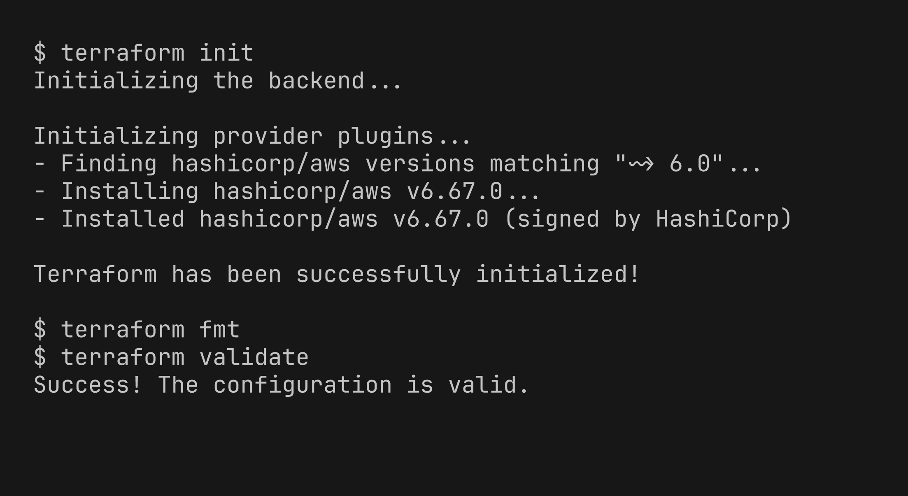
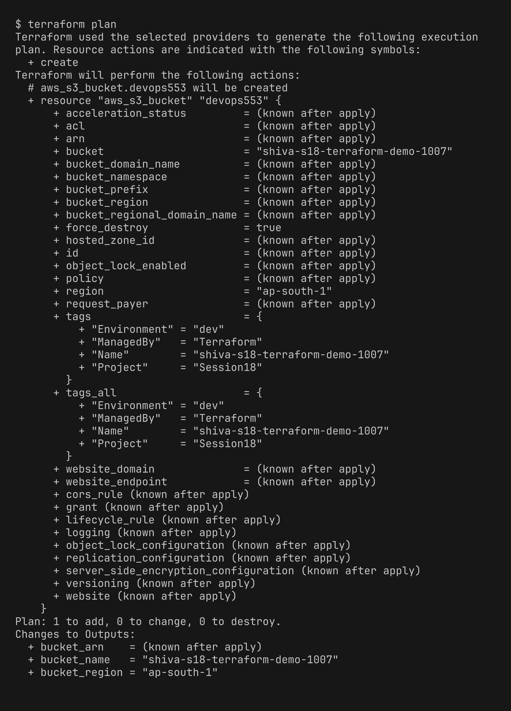
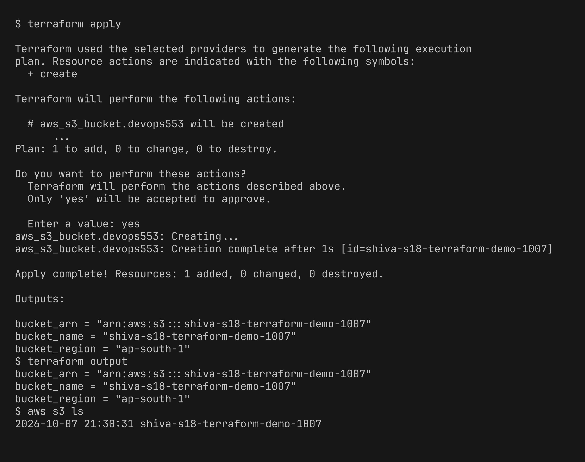
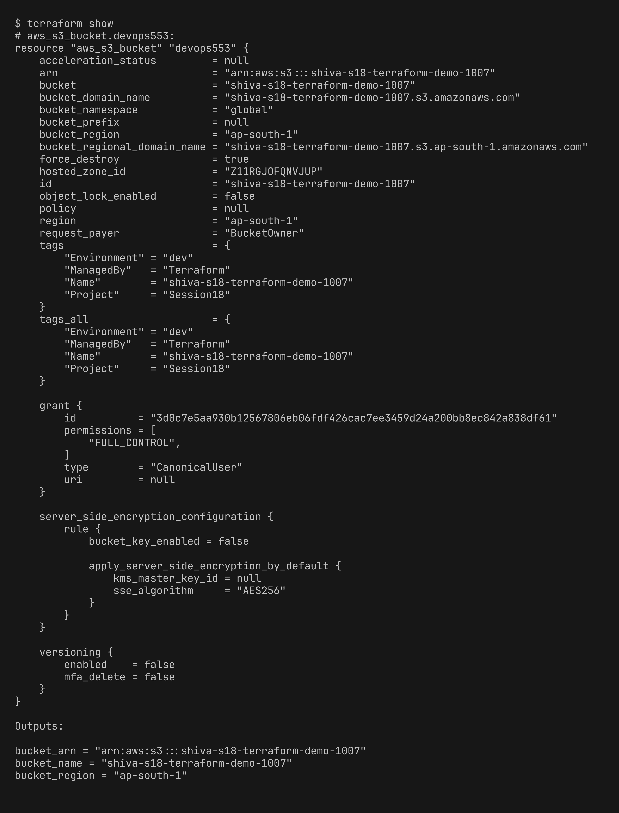
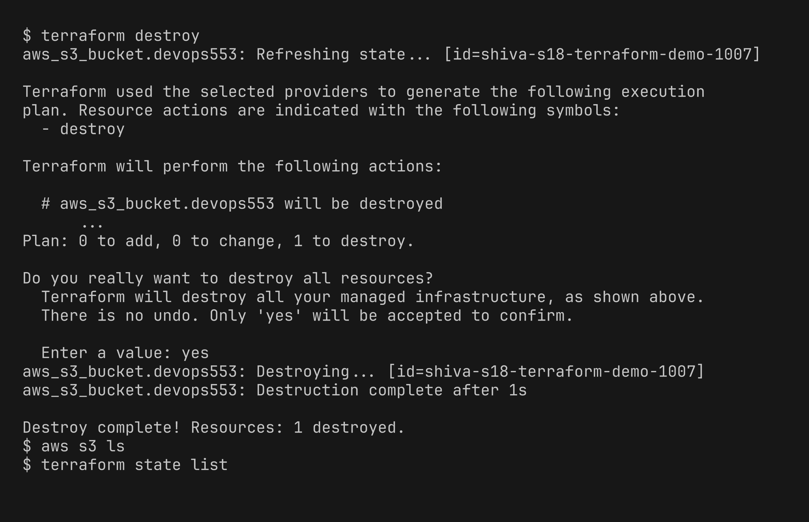

# Session 18 - Terraform & IaC Homework

# Task 1: Terraform S3 Demo

Project: [terraform-s3-demo/](terraform-s3-demo/)

```text
terraform-s3-demo/
├── main.tf            # aws_s3_bucket resource
├── variables.tf       # aws_region, bucket_name
├── outputs.tf         # bucket_name, bucket_arn, bucket_region
├── provider.tf        # aws provider, region from variable
├── terraform.tf       # required terraform + aws provider version
├── terraform.tfvars   # my values
└── README.md
```

`terraform.tfvars`

```hcl
aws_region  = "ap-south-1"
bucket_name = "shiva-s18-terraform-demo-1007"
```

Changes I made to the given code:
- `outputs.tf` had `type = string` inside the output blocks. Older Terraform versions reject `type` in an output (it was only allowed in variables), so I removed it to keep the code working on any version. My version (1.16) accepts it either way.
- Renamed `providers.tf` to `provider.tf` as asked in the task, and added `terraform.tfvars` (bucket names are global so I used my own unique name). `*.tfvars` was in `.gitignore`, I added an exception for this file since it has no secrets.

AWS credentials are set with `aws configure` using an IAM user that has `AmazonS3FullAccess`.

**init, fmt, validate**

`init` downloads the aws provider and makes the lock file. `fmt` prints nothing because the files were already formatted. `validate` checks the syntax.



**plan** - shows 1 bucket to add, nothing is created yet.



**apply, output** - bucket created, verified with `aws s3 ls` also.



**show** - reads the state file and shows all attributes of the bucket. S3 added AES256 encryption by default even though I didn't set it.



**destroy** - bucket deleted, `aws s3 ls` and `terraform state list` are empty after it.



Workflow summary:

| Command | What it does |
|---|---|
| `terraform init` | downloads provider plugins, sets up backend |
| `terraform fmt` | formats .tf files |
| `terraform validate` | checks config is valid |
| `terraform plan` | shows what will change |
| `terraform apply` | creates the resources (asks yes) |
| `terraform show` | shows resources from state |
| `terraform output` | prints output values |
| `terraform destroy` | deletes everything in state |

# Task 2: AWS Services Research

- [01-iam](aws-services/01-iam/README.md) - IAM (Governance)
- [02-ec2](aws-services/02-ec2/README.md) - EC2 (Compute)
- [03-s3](aws-services/03-s3/README.md) - S3 (Storage)
- [04-vpc](aws-services/04-vpc/README.md) - VPC (Networking)
- [05-dynamodb-rds](aws-services/05-dynamodb-rds/README.md) - DynamoDB & RDS (Database)
