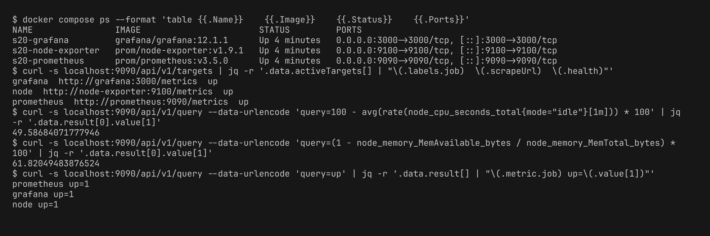
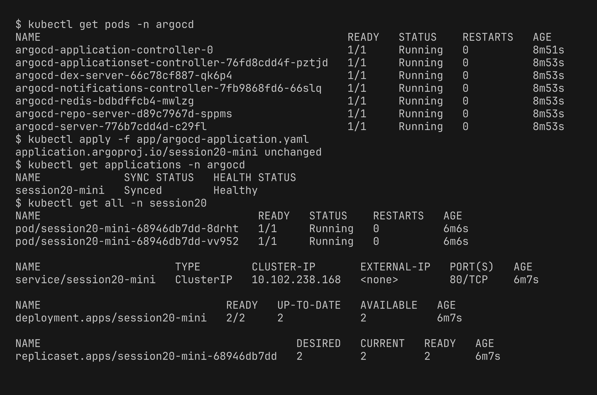
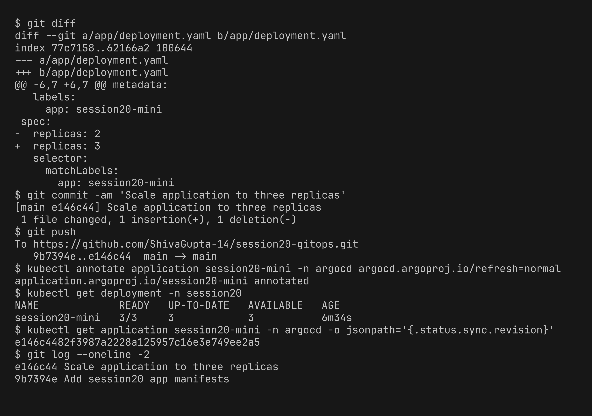
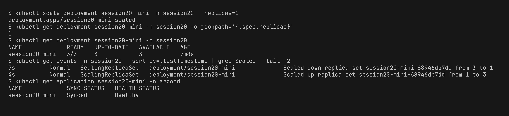

# Session 20 - Monitoring, Observability & GitOps Homework

# Task 1: Monitoring

Folder: [09-monitoring-demo/](09-monitoring-demo/)

I extended the Prometheus + Grafana compose from the session:

| File | What it does |
|---|---|
| [docker-compose.yml](09-monitoring-demo/docker-compose.yml) | Prometheus, node-exporter (host CPU/memory), Grafana |
| [prometheus.yml](09-monitoring-demo/prometheus.yml) | scrapes prometheus, node-exporter, grafana every 5s and loads the alert rules |
| [alert-rules.yml](09-monitoring-demo/alert-rules.yml) | `TargetDown` (up == 0), `HighCpuUsage` (> 80%), `HighMemoryUsage` (> 80%) |
| [grafana/provisioning/](09-monitoring-demo/grafana/provisioning/) | Prometheus datasource + dashboard loaded automatically on start |

```bash
cd 09-monitoring-demo
docker compose up -d
```

**Metrics, CPU, memory, application health**

All 3 targets are `up`. CPU and memory are calculated with PromQL from node-exporter metrics. `up` = 1 means the app answered the scrape, so it is used as the health check.



**Alerts and logs**

I stopped node-exporter to break a target. `up` went to 0 and after 15s the `TargetDown` alert went to **firing**. After starting it again `up` is back to 1 and there are no active alerts. Logs of the containers are checked with `docker logs`.


**Grafana dashboard** (http://localhost:3000) - CPU %, memory %, target health and request rate. The small dip in the `node` tile is from the alert test above.


# Task 2: Observability

[observability/README.md](observability/README.md) - metrics, logs and traces, why observability is needed, common tools and Kubernetes observability.

# Task 3: GitOps

Notes: [gitops/README.md](gitops/README.md) - what is GitOps, Git as source of truth, declarative config, continuous reconciliation, workflow, Kubernetes + GitOps.

**Demo** with Argo CD on minikube, using the [08-mini-project](08-mini-project/) manifests.

GitOps repo: https://github.com/ShivaGupta-14/session20-gitops

```text
session20-gitops/
└── app/
    ├── namespace.yaml
    ├── deployment.yaml   # replicas: 2 at the start, changed to 3 in step 2
    └── service.yaml
```

[argocd-application.yaml](08-mini-project/app/argocd-application.yaml) points to this repo (`path: app`, `automated` with `prune` and `selfHeal`). It is kept outside the repo path so Argo CD doesn't manage its own Application.

```bash
minikube start -p s20 --cpus=4 --memory=4096
kubectl create namespace argocd
kubectl apply -n argocd --server-side -f https://raw.githubusercontent.com/argoproj/argo-cd/stable/manifests/install.yaml
kubectl apply -f 08-mini-project/app/argocd-application.yaml
```

**1. Argo CD running and app synced from Git** - Argo CD created the namespace, deployment (2 replicas) and service from the repo. Status is `Synced` and `Healthy`.



**2. Change through Git (replicas 2 -> 3)** - I only changed the YAML in Git and pushed, no `kubectl` on the deployment. I annotated the app with refresh so it doesn't wait for the 3 min poll. Argo CD synced the new commit `e146c44` and the deployment went to 3/3.



**3. Self-healing (continuous reconciliation)** - I scaled it to 1 by hand to create drift. Since Git still says 3 and `selfHeal: true`, Argo CD put it back to 3 in about 3 seconds (see the events: 3 -> 1 then 1 -> 3).



```text
Git (replicas: 3)  = desired state
Kubernetes         = actual state
Argo CD            = compares and reconciles
```
