
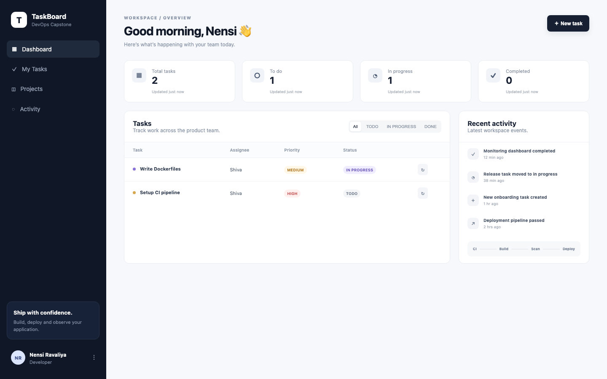
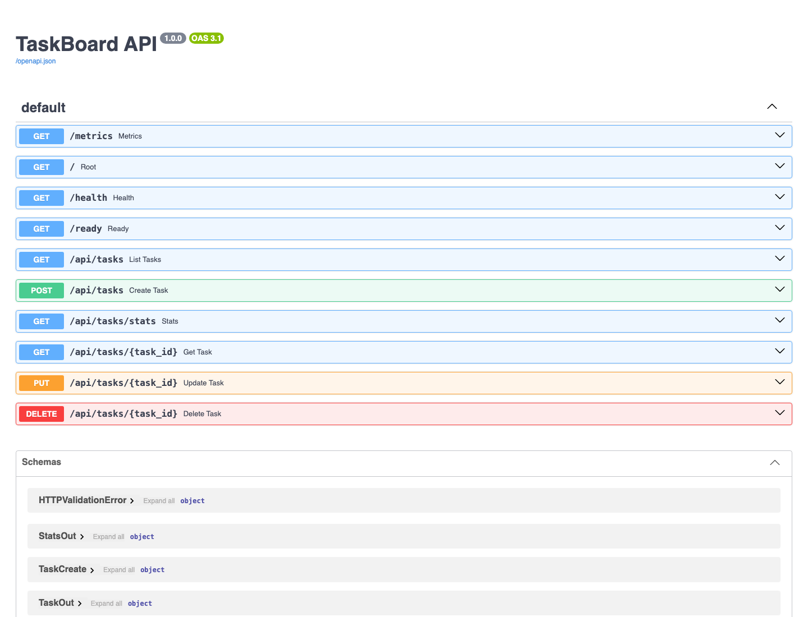

# Session 21 - TaskBoard with Docker Compose

TaskBoard app has 3 parts:

- **frontend** - React + Vite, built in a multi-stage [Dockerfile](frontend/Dockerfile) (node build -> nginx). Nginx also proxies `/api` to the backend.
- **backend** - FastAPI, [Dockerfile](backend/Dockerfile) runs `alembic upgrade head` and then uvicorn on port 8000, as a non-root user.
- **postgres** - `postgres:16-alpine` with a named volume for data.

All three are defined in [docker-compose.yml](docker-compose.yml).

**Fix I made:** the backend was crashing on first start because it ran the migration before postgres was ready (`connection refused`). I added a `pg_isready` healthcheck to postgres and `condition: service_healthy` to the backend `depends_on`.

## 1. Start the stack

```bash
cd session21-python
docker compose up -d --build
docker compose ps
```


## 2. Test backend APIs

Checked health, created two tasks with POST, then listed them and got the stats.

```bash
curl -X GET http://localhost:8000/health
curl -X POST http://localhost:8000/api/tasks -H 'Content-Type: application/json' -d '{"title":"Setup CI pipeline","priority":"HIGH","assignee":"Shiva"}'
curl -X GET http://localhost:8000/api/tasks
curl -X GET http://localhost:8000/api/tasks/stats
```



## 3. Application in browser

TaskBoard UI at http://localhost:3000 showing the tasks created above.



Swagger UI at http://localhost:8000/docs with all the endpoints.


