# Session 9 - Kubernetes Fundamentals Homework

## 1. Install and configure Minikube

Installed minikube with brew on my Mac and started a 2 node cluster.

```bash
brew install minikube
minikube start --nodes 2
minikube version
```

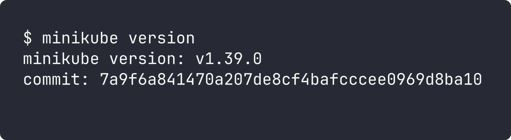

## 2. Verify cluster status

```bash
minikube status
kubectl cluster-info
kubectl get nodes -o wide
```

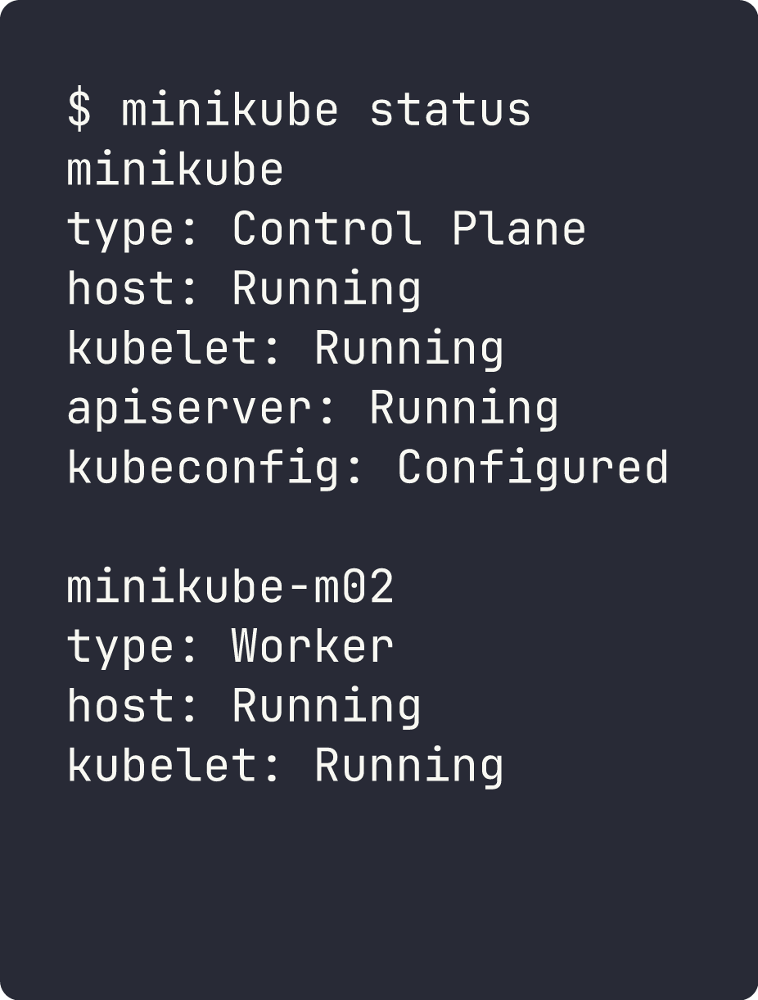

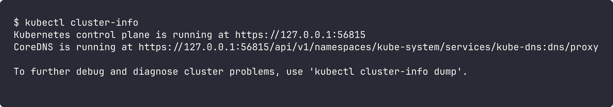

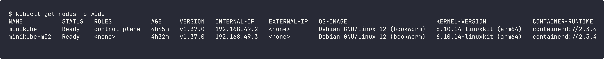

## 3. Kubernetes architecture (short notes)

The control plane components run as pods in `kube-system`:

```bash
kubectl get pods -n kube-system
```

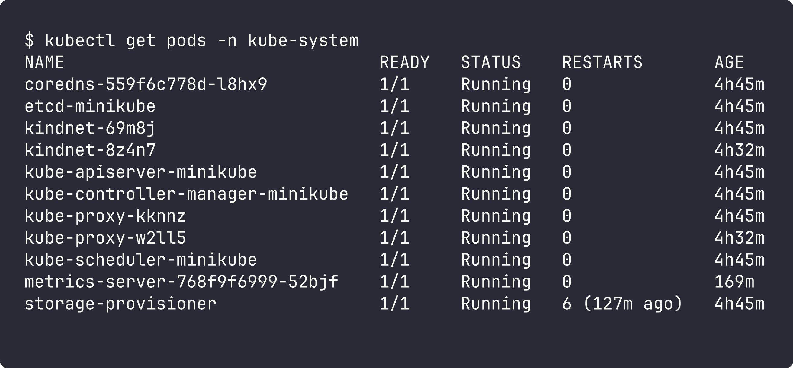

**Control plane (master)**
- **kube-apiserver** - front door of the cluster. kubectl and every other component talk to it.
- **etcd** - key value store that keeps the whole cluster state.
- **kube-scheduler** - picks a node for every new pod based on resources, taints, affinity etc.
- **kube-controller-manager** - runs controllers (deployment, replicaset, node...) that keep actual state equal to desired state.

**Worker node**
- **kubelet** - agent on each node, starts the containers of pods given to that node and reports status.
- **kube-proxy** - sets up the network rules so Services can route traffic to pods.
- **container runtime** - actually runs containers (containerd in my cluster).

Addons I saw: **CoreDNS** for service discovery, **kindnet** as CNI for pod networking.

## 4. Basic objects and commands

| Object | What it does |
|---|---|
| Pod | smallest unit, one or more containers sharing network/storage |
| ReplicaSet | keeps a fixed number of pod copies running |
| Deployment | manages ReplicaSets, gives rolling update and rollback |
| Service | stable IP/DNS name to reach a set of pods |
| Namespace | logical separation of resources |

Common commands: `kubectl get`, `kubectl describe`, `kubectl logs`, `kubectl exec`, `kubectl create`, `kubectl apply`, `kubectl delete`, `kubectl scale`, `kubectl rollout`.

## 5. Kubernetes Basics tutorial (hands-on)

I did all the tutorial modules in a separate namespace `s9`.

### Module 2 - Create a deployment

```bash
kubectl create ns s9
kubectl create deployment kubernetes-bootcamp --image=docker.io/jocatalin/kubernetes-bootcamp:v1 -n s9
kubectl get deployments,pods -n s9 -o wide
```

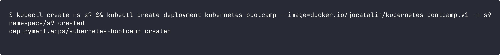

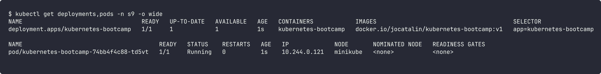

### Module 3 - Explore the app (logs and exec)

```bash
kubectl logs <pod-name> -n s9
kubectl exec -n s9 <pod-name> -- curl -s localhost:8080
```

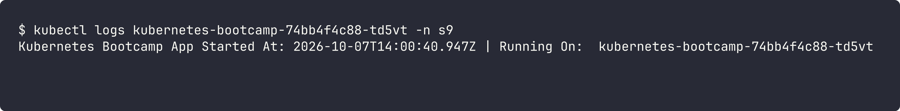

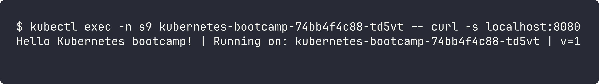

### Module 4 - Expose the app with a Service

```bash
kubectl expose deployment/kubernetes-bootcamp --type=NodePort --port 8080 -n s9
kubectl get svc -n s9
kubectl run curl --rm -i --restart=Never --image=curlimages/curl -n s9 -- curl -s kubernetes-bootcamp:8080
```

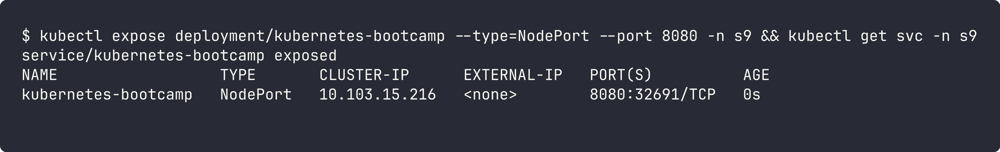

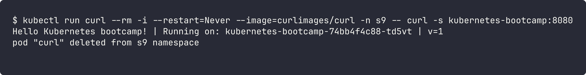

Using labels:

```bash
kubectl label pod <pod-name> version=v1 -n s9
kubectl get pods -l version=v1 -n s9
```

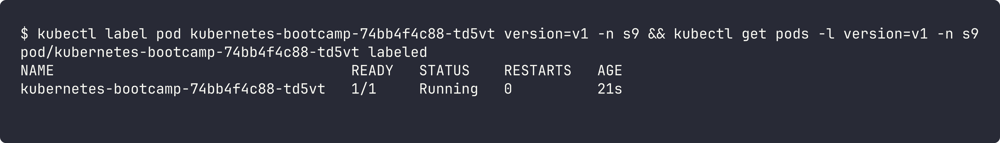

### Module 5 - Scale the app

```bash
kubectl scale deployment/kubernetes-bootcamp --replicas=4 -n s9
kubectl get pods -n s9 -o wide
```

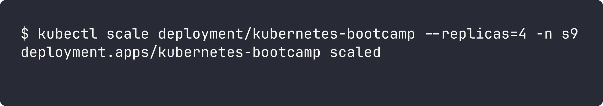

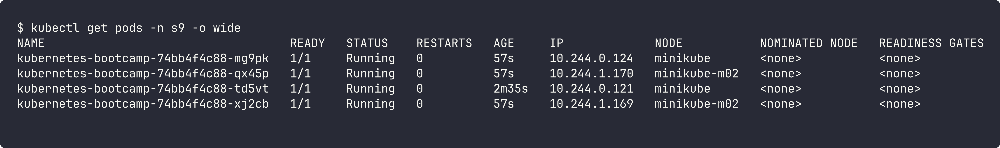

4 pods are running and they got spread over both nodes (minikube and minikube-m02).

### Module 6 - Rolling update and rollback

```bash
kubectl set image deployment/kubernetes-bootcamp kubernetes-bootcamp=docker.io/jocatalin/kubernetes-bootcamp:v2 -n s9
kubectl rollout status deployment/kubernetes-bootcamp -n s9
```

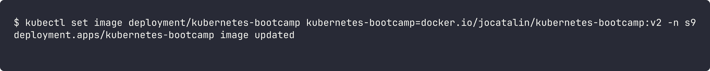

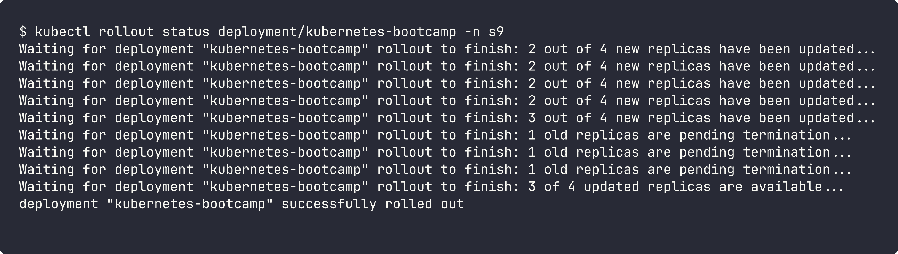

App now replies with `v=2`:

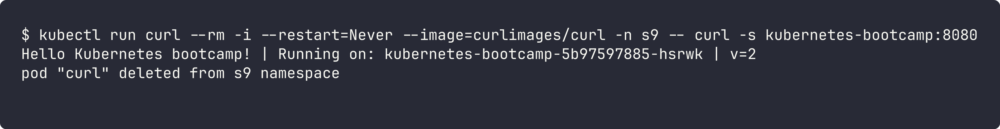

Rollback to v1:

```bash
kubectl rollout undo deployment/kubernetes-bootcamp -n s9
kubectl get deployment kubernetes-bootcamp -n s9 -o wide
```

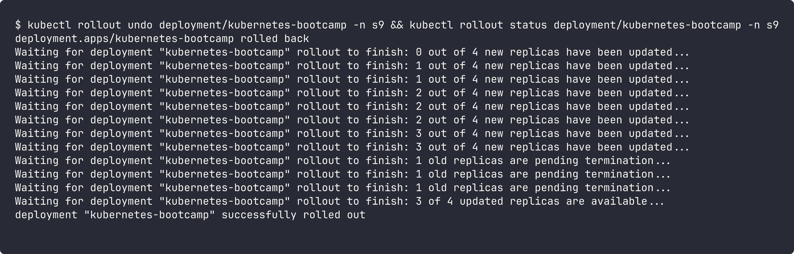

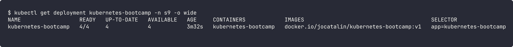

Image is back to `kubernetes-bootcamp:v1`.
